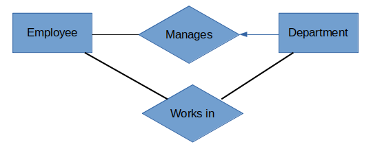

# Database Management Systems

# P1 FOUNDATIONS
### 1. Overview
###

#### Overview
- **Database:** A collection of data, typically describing the activities of an organization
- **DBMS:** A software designed to assist in maintaining and utilize large collections of data.
- **Advantages of DBMS:**
  - Data Indepenedance: Application programs need not be exposed with the details of data represenataion and storage.
  - Efficient Data Access: Uses very sophisticated techniques to store and retrieve data efficiently.
  - Data Integrity and Security: It has integrity constratints that are enforced when data is accessed through  DBMS.
  - Data Administration: 
  - Concurrent Access and Crash Recovery:
  - Reduced Application Development time:
- **Data model:** A collection of high-level data description constructs that hide many low level storage details.
  - Example : Relational Data model
- **Semantic Data Model:** A more abstract high level data model that makes the task of initial description of data in an enterprise easily.
  - Example: ER Model
- **The Relational Model:**
  - Central data description construct is a *Relation*, which is a set of records.
  - Note: A description of data in terms of data model is called schema.
  - A schema in relational model specify name of the field (attribute), type of each field
  - **Integrity Constraints:** Conditions that the records in a relation must satisfy.
- **Levels of Abstratction in DBMS:**
  - **Conceptual:** Describes the data stored in terms of data model of DBMS. In RDBMS, conceptual schema describes all the relations stored in DBMS. The choice of relations and the choice of fields for each is not obvious and the process of arriving at a good conceptual schema is called *conceptual database design*. Example: Relations
  - **Physical Schema:** Specifies additional storage details, summarizes how the relations in conceptual schema are stored in storage devices. Example: Indexing, unsorted file records etc.,
  - **External Schema:** Usually in terms of data model of DBMS but allows customization based on the end user. For a given database there is only one conceptual and only one physical schema. But there may be many external schemas. Example: Views.
- **Queries:**
- **Transaction Management:**
  - When several users access a database concurrently, the DBMS must carefully order their requests to avoid conflicts.
  - DBMS must protect users from the effects of system failures  like crashes, power failures etc.,
  - Should provide the facility of concurrent execution of any user transactioni.
- **DBMS Architecture:**
  - Please refer to the Figure1, in the same GIT Repo.

#### ER Model
- ER model allows us to describe the real-world data in terms of objects and thier relationships and is widely used to develop initial database design.
- ER diagrams are used in conceptual database design to move from more inforaml description of user requirement to what can be implemented in a DBMS.
- **Database design Process:**
  - Requirement Analysis: 
  - Conceptual Database Design:
  - Logical Database Design:
  - Schema Refinement
  - Physical Database Design
  - Application and Security Design
- **Entity:** An object in a real world that is distinguishable from other objects.
- **Entity Set:** Collection of similar entities(By similar I mean, that all the entities have same attributes).
- **Attributes:** Set of properties associated to an entity are called attributes.
- Attributes are of designer choice how detailed view he/she likes to represent the data.
- For each attribute, the possible values are determined by domain.
- **Key:** A minimal set of attributes whose values uniquely identify an entity in the set.
- **Relationship:** An association among 2 or more entities.
- **Relationship set:** A set of similar relationships is called a relationship set.
  - Defined as {(e1,e2,e3...en) | e1 is in E1, e2 is in E2 ..... en is in En}.
  - Where E1,E2,E3..En are entity sets and e1,e2,...en are entities.
- **Descriptive Attributes:** Attributes which define the relationship is called descriptive attributes.
  - These are used to describe about the relationship.
- **Instance:** A snapshot of a relationship set at some point of time.
- Note: The entities involved in a relationship need to be distinct, there can be a relation between 2 entities in same entity set.
- **Key Constraints:** The restriction that we impose on the association in a  relation is called key constraints.
  - Example: Let's say the two entities Employee and Department, and the relation Manages. We have a restriction that atmost one manager can manage a department. We explain this by placing and arrow (Solid arrow '<|' ) from Entity Department to Relation Manages.

   

  - The above relation is called one to many relation, that is one employee can manage many departments, where as if a department is considered, a department can be managed by atmost one employee.
- **Participation Constraints:** The restrictions on the participation of the entity sets in the relation is called Participation constraints.
  - **Total participation:** If the whole entity set is participating in the relation, then it is called total participation
  - **Partial participation:** If there is only partial entity set in the relation, then it is partial participation.
  - Example: Let's say in the above example, if there should not be a department without a manager, then all the entities in the entity set of Department will be in Manages relation. So in that case Department entity set is having Total participation. And in the same example, every employee need not manage a department, so Employee entity set is having partial participation.
  - Total pariticipation is indicated by thick line(double line) and partial participation is indicated by thin line (single line)
- **Weak Entities:** 