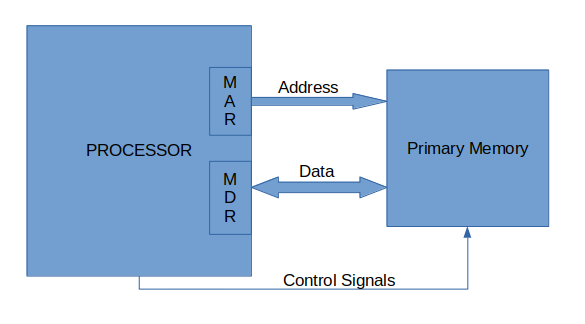
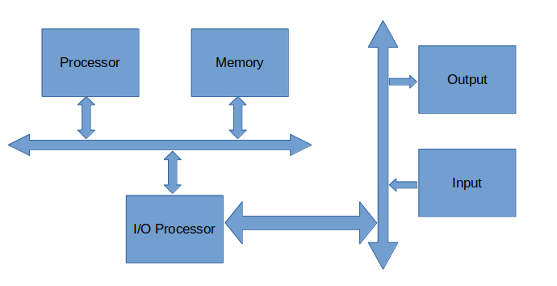

# Computer Organization And Architecture

#### CONTENTS
1. [Introduction](computer_organization.md#Introduction) 
2. [Evolution of Computer System](computer_organization.md#Evolution-of-computer-system)


-------------------------------------------------------------------------------
### Introduction

- Computer Organization:
  - Design of the components and functional blocks using which computer systems are built.
  - Analogy: civil engineer's task during building construction(cement, bricks, iron rods and other building materials).
- Computer Architecture:
  - How to integrate the components to build a computer system to achieve a desired level of performance.
  - Analogy: Architect's task during the planning of a building(overall layout, floor plan etc.,)

-------------------------------------------------------------------------------

### Evolution of Computer System
- A search to automate computing systems has lead to the evolution of Computers to what they are today.
- Initially they have done mechanical pullies and gears, then they used mechanical relays to calculate computations, then vaccum tubes were developed and then semiconductors are developed.
- Thus we moved from SMALL SCALL INTEGRATION(SSI) to MSI to LSI to VLSI to ULSI.
  ```
  ________________________________________________________________________________________________
  | Generation      | Main Technology              |  Representative Systems                      |
  -------------------------------------------------------------------------------------------------
  | First (1945-54) | Vaccum tubes, relays         | Machine & assembly language (ENIAC, IBM-701) |
  -------------------------------------------------------------------------------------------------
  | Second(1955-64) | Transistors, memories,       | Batch processing systems, HLL IBM-7090       |
  |                 | IO processers                |                                              |
  -------------------------------------------------------------------------------------------------
  | Third(1965-74)  | SSI and MSI integrated       | Multiprogramming/Time Sharing IBM 360,       |
  |                 | circuits Microprogramming    | Intel 8008                                   |
  -------------------------------------------------------------------------------------------------
  | Fourth(1975-84) | LSI anvd VLSI IC's           | Multiprocessors Intel 8086, 8088             |
  -------------------------------------------------------------------------------------------------
  | Fifth(1984-90)  | VLSI, multiprocessor         | Parallel computing, Intel 486                |
  |                 | on chip                      |                                              |
  -------------------------------------------------------------------------------------------------
  | Sixth(1990-)    | ULSI, scalable architecture, | Massively parallel processors Pentium,       |
  |                 | post CMOS technologies       | SUN ultra workstations                       |
  -------------------------------------------------------------------------------------------------
  ```
- Vaccum tube is a device which controls electric current between electrodes in an evacuated container in a tube.
- Moore's Law:
  - It refers to an observation made by Intel cofounder Gordon Moore in 1965.
  - He noticed that the number of transitors per square inch on IC's has doubled every year since their invention.
  - Moore's law predicts that this trend will continue into the forseeable future. Although the pace has slowed, the number of transistor per square inch has since doubled approximately every 18 months. This is used as a current definition of Moore's law.
- Simplified block diagram of a Computer System:( VON-NEUMANN Architecture, also called stored-program concept)

  

  - Von-Neumann architecure is also called stored-program concept because the program to execute is stored in the memory and the instructions are brought to the processor for execution. And before bringing the instruction to the processor that program/process must be stored in the memory.
  - Processor:
    - Also called CPU: Central Processing Unit.
    - Control Unit: Generates the sequence of control signal to carry out the operaitons.
      - The nerve center that senses the states of various functional units and sends control signals to control their states.
      - To perform the operation the CU must generate the signals in a specific sequence.
      - After fetching the instruction form memory, the operation to be performed is decoded(from what we call opcode) by the CU.
    - ALU: Arithemetic Logical Unit, all the calculations happen inside ALU.
      - Contains several registers, general-purpose registers, special-purpose registers, temporary registers.
      - Contains circuitry for logical operations like AND, OR, NOT, SHIFT, COMPARE and arithemetic operations like addition, subtraction, multiplication, division etc.,.
      - During the execution of instruction, the data to be operated on is brought and stored in some register, the desired operation is performed and the result is stored in some register/memory.
      - Instructions are fetched from memory for execution. And each instruction specifies the operation to be performed and on what data it is to be performed.
  - Memory Unit:
    - Two types:
      - Primary or Main memory: stores the active instructions and data for program being executed on the processor.
      - Secondary memory: used as a backup and stores all active and inactive programs and data, typically as files.
    - The processor only has direct access to the primary memory.
    - In general memory is implemented as hierarchy to provide faster access at affordable cost. L1 Cache <- L2 Cache <- L3 Cache <- Primary memory <- Secondary Memory.
  - Input Unit: Used to feed data to the computer system from the external environment.
  - Output Unit: Used to send the result of some computation to the outside world.

-------------------------------------------------------------------------------

### Basic Operation of a Computer

- Each operation is carried in the computer in terms of instructions.
- There are special purpose registers and general purpose registers. General purpose registers are used to store the intermediate values or a final result of an operation. Special purpose registers have a specific purpose and can't be used for genral result storing.
- Memory is considered as an array of storage locations (can be bytes or words) each having a unique address.
- A program refers to a set of instructions that are required to carry out a specific task.
- Special Purpose Registers:
  - For interfacing between processor and primary memory are:
    1. Memory Address Register(MAR): Holds the address of the memory location to be accessed.(either for instruction read, or for data read or for data write).
    2. Memory Data Register(MBR): Holds the data that is being written into memory, or will receive the data being read out of memory.

  

    - To summarize:
      - To read data from Memory:
        1. Place the address in MAR from where the read is to happen.
        2. Issue the READ control signal.
        3. Data is loaded to data bus and thus to MDR.
      - To write data to memory:
        1. Place the address in MAR to where the write is to happen.
        2. Data to be written is loaded to MDR.
        3. Issue the WRITE control signal.
  - For keeping track of program/instructions are:
    1. Program Counter(PC): Holds the memory address of the next instruction to be executed. This is automatically incremented to point to the next instruction when an instruction is being executed.
    2. Instruction Register(IR): Temporarily holds an instruction that has been fetched fro memory. This instruction is decoded to find out the instruction type and also contains information about the location of the data.
- Example instruction execution:
  1. ADD R1, LOCA --> Need to add the contents of memory location of LOCA and the contents of GPR R1 and store back the result in GPR R1.
     - Symbolically: R1 <- R1 + Mem[LOCA]
     - Assumptions: The instruction is stored in memory location 1000, the initial value of R1 is 50 and LOCA is 5000.
     - Execution:
       - Contents of PC is transferred to MAR. * --> MAR <- PC *
       - READ request is issued to memory unit.
       - The instruction is fetched to MDR. * --> MDR <- Mem[MAR] *
       - Content of MDR is transferred to IR. * --> IR <- MDR * 
       - PC is incremented to point to next instruction. * --> PC <- PC + 4 * (4 because iof word size in 32 bit machine)
       - The instruction is decoded by CU.
       - LOCA is transferred to MAR. * --> MAR <- IR[Operand] *
       - READ request is issued to Memory Unit.
       - The data is transferred to MDR. * --> MDR <- Mem[MAR] *
       - The content of MDR is added to R1. * --> R1 <- R1 + MDR *
     - The actual micro-operations that took place are:
       ```
       MAR <- PC
       MDR <- Mem[MAR]
       IR <- MDR
       PC <- PC + 4
       MAR <- IR[Operand]
       MDR <- Mem[MAR]
       R1 <- R1 + MDR
       ```
  2. ADD R1, R2 --> Need to add the contents of GPR R1 and GPR R2 and store the result back in GPR R1. 
     - Symbolically: R1 <- R1 + R2
     - Assumption: Instruction is stored in memory location 1500, initial value of R1 is 50 and R2 is 200.
     - Execution:
       - Contents of PC is transferred to MAR. * --> MAR <- PC *
       - READ request is issued to memory unit.
       - The instruction is fetched to MDR. * --> MDR <- Mem[MAR] *
       - Content of MDR is transferred to IR. * --> IR <- MDR * 
       - PC is incremented to point to next instruction. * --> PC <- PC + 4 * (4 because iof word size in 32 bit machine)
       - The instruction is decoded by CU.
       - R2 is added to R1, * --> R1 <- R1 + R2 *
     - The actual micro-operations are:
       ```
       MAR <- PC
       MDR <- Mem[MAR]
       IR <- MDR
       PC <- PC + 4
       R1 <- R1 + R2
       ```
- Bus Architecture:
  - Communication path way.
  - The different functional modules must be connected in an organized manner to form and operational system.
  - Bus refers to a group of lines that serve as a connecting path for several devices
  - The simplest way to connect the functional unit is to use the single bus architecture.
    - Only one data transfer allowed in one clock cycle.
    - For multi-bus architecture, parallelism in data transfer is allowed.

    

    

- Single Bus Architecture inside the processor:
  - All the above bus architecture are at system level. But we need a bus inside the processor itself, because there are many data transfers from GPRs to ALU and control signal from CU to other units etc.,
  - ALU and registers are all connected via the single bus.
  - This bus is internal to the processor.
  - A typical single bus processor architecture is as follows:

    

- Multi-Bus Architecture inside the processor:
  
-------------------------------------------------------------------------------
