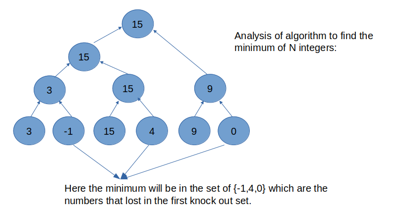

# Data Structures

#### CONTENTS
1. [Introduction](data_structures.md#Introduction) 
2. [Data Structuring - Case Study](data_structures.md#Data-Structuring)

-------------------------------------------------------------------------------
### Introduction

- The issue at hand in most computer tasks is PROBLEM SOLVING. So our aim is to understand how to solve the problem on a computer efficiently.
- Example: find the max out of n numbers:
  - Mathematical approach 1:
    ```
    Let L = {t1, t2, t3, ... tn}
    We find the max asumming L = {t1}
    Now we use the above and find the max for L = {t1,t2}
    Using the above solution, we finf the max for L = {t1,t2,t3}
    ..
    ..
    ..
    Repeating this till tn will give the max of L = {t1, t2, t3, ... tn}
    ```
  - Mathematic Approach 2: we can decompose the problem
    ```
    Let L = {t1, t2, t3, ... tn}
    MAX(L) {
        split L into 2 disjoint non-empty sets L1 & L2
        MAX1 = MAX(L1)
        MAX2 = MAX(L2)
        if MAX1 > MAX2 then MAX = MAX1 else MAX = MAX2
        Print MAX
    }
    ```
- Based on the above examples, the broad steps in problem solving methodology will be as follows:
  1. Initial solution generation. (Decomposition of the problem)(Solution in your own mind)
     - contains a set of actual potential programs
  2. Initial solution refinement.
     - To decide which is the best we consider efficiency(time, space).
   - Note: Now with initial solution in hand, there are certain techniques which are standards. We come across terms lik Algorithm Design and Data Structuring.
  3. Final Solution. (In Vehicle Language)
- After deciding the final solution with the above steps, now we come to the part of programming the solution.
- A high level programming language provide the features like:
  - Data strcuturing: Data types, operations on them. Data procedure encapsulation. Dynamic data structuring.
  - Algorithmic expression: Control constructs, functions(recursive and non-recursive).

- Note: The Calling in C Programming Language is CALL BY VALUE.
  - There are three different paradigms for function calling: 1. CALL BY VALUE, 2. CALL BY VALUE RESULT, 3. CALL BY REFERENCE.

-------------------------------------------------------------------------------

### Data Structuring
- Case Studies:
  1. Find the maximum and minimum of N integers.
     - So as a quick solution someone would start with the program to find the maximum of N numbers and tweak that to find both maximum and minimum of N numbers.
     - Program to find the maximum of N integers would look like follow:
       ```
       main() {
           int n,max, i, numb;
	   printf("Give N: ");
	   scanf("%d", &n);
	   printf("\n n = %d", n);
	   scanf("%d", &max);
	   for (i = 1; i <= n - 1; ++i) {
	       scanf("%d", &numb);
	       if (numb > max) max = numb;
	   }
	   printf("MAX = %d", &max);
       }
       ```
     - We could change the above program to find the maximum of numbers as follows to find both maximum and minimum.
       ```
       main() {
           int n,max, i, numb, min;
	   printf("Give N: ");
	   scanf("%d", &n);
	   printf("\n n = %d", n);
	   scanf("%d", &max);
	   min = max;
	   /* here for each iteration, we compulsory make 2 comparisons,
	      so there are 2(n-1) comparisons happenning */
	   for (i = 1; i <= n - 1; ++i) {
	       scanf("%d", &numb);
	       if (numb > max) max = numb;
	       if (numb < min) min = numb;
	   }
	   printf("MAX = %d \n", &max);
	   printf("MIN = %d \n", &min);
       }
       ```
     - The above program is correct and it will work fine. But our question now is: Is this the best program? Or can we write a program that is better than this?
     - So now we have to define how we measure the *BETTER*: we use the execution time/ speed of the program for this.
     - Now we can modify the above code by adding a simple else for the second if statement, because for any given number both the conditions will not be true at the same time. If numb > max, then numb < min will not be true. Thus there will be an increase in the speed of execution of program(might be very minimal value, but still it is an improvement).
       ```
       main() {
           int n,max, i, numb, min;
	   printf("Give N: ");
	   scanf("%d", &n);
	   printf("\n n = %d", n);
	   scanf("%d", &max);
	   min = max;
	   /* here for each iteration, the 2 comparisons may or may not happend,
	      so there are <= 2(n-1) comparisons happenning */
	   for (i = 1; i <= n - 1; ++i) {
	       scanf("%d", &numb);
	       if (numb > max) max = numb;
	       else if (numb < min) min = numb;
	   }
	   printf("MAX = %d \n", &max);
	   printf("MIN = %d \n", &min);
       }
       ```
     - What we have done is that, we have taken the already designed algorithm for finding maximum of N integers and tweaked that to also find the minimum.
     - Now let's analyze the algorithm for finding maximum of N integers and see what can we do to find the maximum and minimum of N integers with an improvement(in number of comparisions).
     - Analysis:
       

       - Here in the above diagram, there is depiction of how the algorithm to find max of N integers. If observed clearly, that has a similarity of a knock-out tournment.
       - Each match is a comparision of 2 numbers. We can arrange the matches in anyway(observe the below image), but we need atleast N-1 matches to decide the winner. So to find the maximum of N integers we need N-1 comparisions.

         

       - So now we need to find minimum of the N integers. If a number win a match in the tournment, then we can say that it can't compete to be a minimum number in the given N integers.
       - So with that observations, the minimum of N integers will be in the set of numbers that got knocked out in the first match set.
       - Explanation:

         

       - So the number of numbers in the set of small will be (N/2), so the number of comparisions required to find the minimum is (N/2) - 1.
       - So to find the MAX and MIN of N integers, the total number of comparisons required are:
         - (N - 1) (for the maximum) + (N/2 - 1) (for minimum
	 - Total = 3N/2 - 2 comparisons
