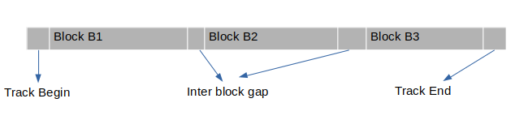
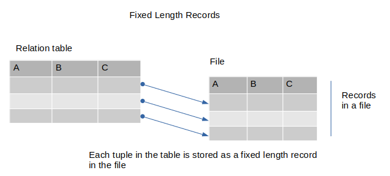
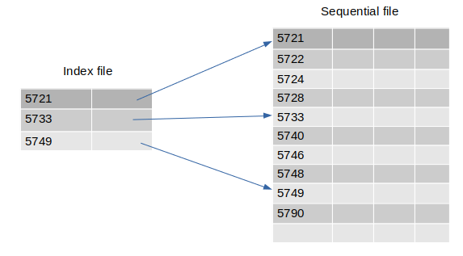
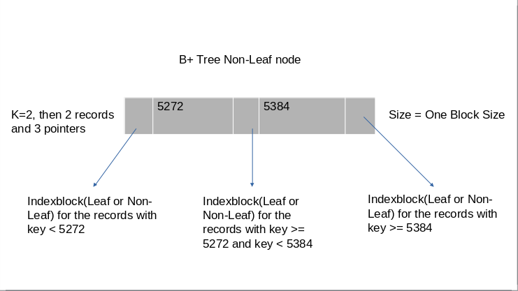
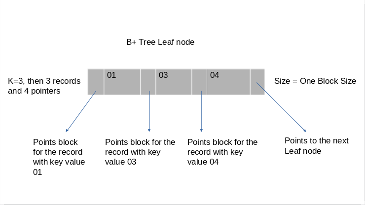
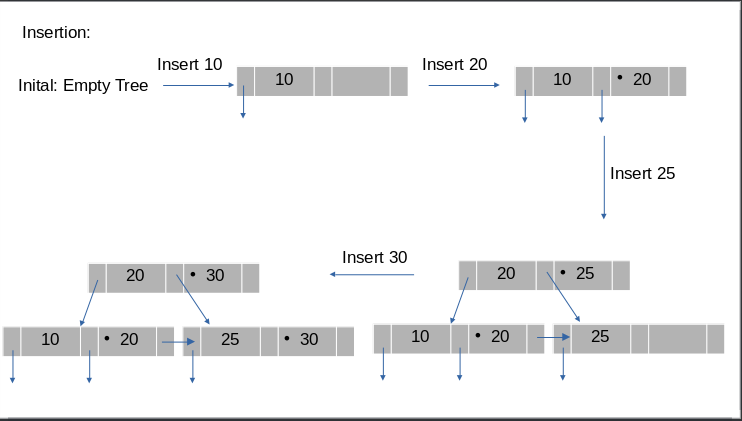
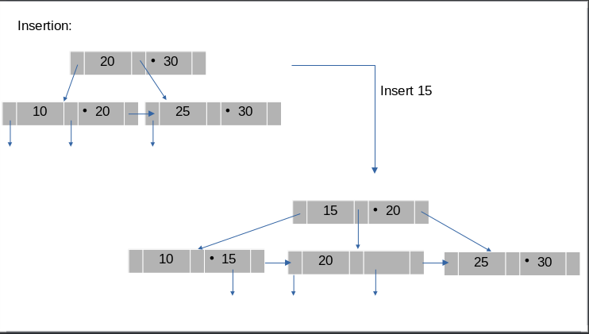
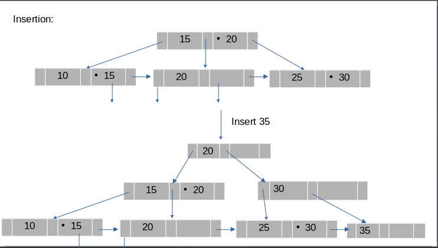
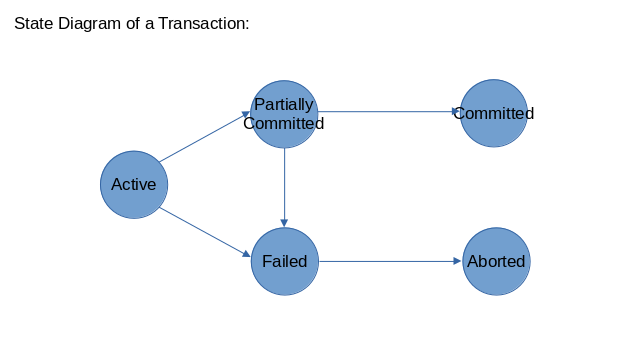

# Database Management Systems

#### Contents
1. [Introduction](database_management_systems.md#INTRODUCTION)
2. [Conceptual Design](database_management_systems.md#CONCEPTUAL-DESIGN)
3. [Relational Algebra](database_management_systems.md#RELATIONAL-ALGEBRA)
4. [Relational Calculus](database_management_systems.md#RELATIONAL-CALCULUS)
5. [SQL](database_management_systems.md#SQL)
6. [Integrity Constraints](database_management_systems.md#INTEGRITY-CONSTRAINTS)
7. [Functional Dependencies](database_management_systems.md#FUNCTIONAL-DEPENDENCIES)
8. [Database Decomposition](database_management_systems.md#DATABASE-DECOMPOSITION)
9. [File System](database_management_systems.md#FILE-SYSTEM)
10. [Recovery From Failure](database_management_systems.md#RECOVERY-FROM-FAILURE)
11. [Concurrency Control](database_management_systems.md#CONCURRENCY-CONTROL)

-------------------------------------------------------------------------------
### INTRODUCTION
- **Database:** Collection of inter-related data.
- **DBMS:** Database and Query engine (a set of software tools to access, process and modify the data in database).
- Early Information systems: Data is stored in disk and application programs are written to access the disk via file system.
  
- Problems with Early Information systems:
  - Disorganized development which causes data isolation and data redundancy
  - Redundancy => Inconsistency
  - Concurrency => updation of shared data
  - Security
  - Integrity constraints
-------------------------------------------------------------------------------
- Role of DBMS:

  
-------------------------------------------------------------------------------
- Levels of Data Abstraction:
  - Physical Level: How the data is stored physically in the disk. (Implementation level)
  - Conceptual Level: What is the data, what are the fields, how the data is related. (Design Level, admin level)
  - View Level: The conceptual level to a sophisticated user/application developer.
  - User Level: The conceptual level to a naive user(who cannot program anything, just to watch the data).
- **Schema:** The definition of the database, what are the fields, what is the type of each field.
- **Instance:** A particular set of data following a schema is called Instance
-------------------------------------------------------------------------------
- Components of a database:
  - User's:
    - Data Definition Language. (DDL)
    - Data Manipulation Language. (DML) (Retrieve, Insert, Delete, Update) => Often called Query Language.
      1) Procedural
      2) Non Procedural
      3) Mixed
- DBMS components:

  
-------------------------------------------------------------------------------
- Role of Database manager: DB manager is very significant part of the DBMS
  - Interface with File manager.
  - Integrity constraint enforcement.
  - Backup and recovery.
  - Concurrecy control.
  - Security.
  - Prevents Data Redundancy and Inconsistency.
-------------------------------------------------------------------------------
- **Data Models:** Tools to conceptually design the database.
  - Entity-Relationship model (Object based model)
  - Relational Model (Record based model)
  - Network Model (Record based model)
  - Hierarchial model (Record based model)
  - Object-Oriented data model (Object based model)
  - Semantic data model (Object based model)
  - Functional data model (Object based model)

- Entity Relationship Model: E-R Model
  - Entities
  - Attributes
  - Relationship
  Example: Library Management

  
  
- Relational model:
  - Tables/Relations (Columns: Attributes of ER model)
  Example: Library management

  
  
- Network Model:
  - Records and Pointers
  Note: Cycles are possible, so it is a graph model

  
  
- Hierarchial Model:
  - Records and pointers
  Note: Only a tree model, may require duplication
      : Useful when the structure is inherantly tree.

  

-------------------------------------------------------------------------------

### CONCEPTUAL DESIGN
- Using Entity Relationship Model (ER Modelling).
-------------------------------------------------------------------------------
- ENTITY: A distinguishable object of a DB.
  Examples:
  - Any particular book (Compiler design by Aho,Sethi, Ullmann published in the year 1992, published by Addison wesley with accession number 722756).
  - Any particular user (Ajay singh , project staff, Cryogenics Dept, Card-No C-56).
  - Any particular supplier to the library.
- ENTITY SET: Collection of entities of same type/structure.
  Example:
  - Book
  - User
  - Supplier
-------------------------------------------------------------------------------
- ATTRIBUTE: Specifies part of any entity structure. It is a mapping from an entity set to a domain of values.
  Note: No two entities will have all the attributes same in an entity set. It is defined as a set by definition.
  Examples:
  - Book entity have the attributes:
    - PUBLISHER which has its value mapped to STRING.
    - NAME which has its value mapped to STRING.
    - AUTHOR which has its value mapped to STRING.
    - ACCESSION NUMBER which has its value mapped to INTEGER.
    - PUBLISHED DATE which has its value mapped to INTEGER.
-------------------------------------------------------------------------------
- RELATIONSHIP: An association/mapping between entities.
- RELATIONSHIP SET: Collection of relationships between same/similar entities(so that it becomes a set of relationships between entity sets).

  

- Note:
  1) The Borrowed By relationship is defined by the attributes from USER and BOOKS entity sets.
  2) The Supplied By relationship is defined by the attributes from USER and SUPPLIERS entity sets.
  3) Other than the attributes from the entities, a relationship may have it's own attributes to define the relationship.
  4) A relationship set may not be binary always, it can be n-ary relationship set.
  5) A relationship set may not be between 2/more different entity sets. It can be between same entity set(one entity set).
     Example:

       

-------------------------------------------------------------------------------
- Mapping Constraints:
  
  
  
  Note: all these are for binary relations.
  - ONE-ONE: One from left entity to only one on right entity.
  - ONE-MANY: One from left entity to many on right entity. But one from left set can't be mapped to many on right set.
  - MANY-ONE: many from left set to one on right set. But one from right set can't be mapped to many on left set.
  - MANY-MANY: Many from left set can be mapped to many on right set. Combination of both MANY-ONE and ONE-MANY.
  
  - There can be some entities in the set that are not at all mapped.
  Note: If there is an arrow on the link between entity set and the relation ship set, then it has either one-many/one-one mapping.
  Note: If there is nothing on the link between entity set and the relationship set, then it has either many-one/many-many mapping.
  TODO: Some clarity needed on the relatioships here. How to place the arrows?
  
  
  - Examples:
    
-------------------------------------------------------------------------------
- Existence Dependencies:
  
  
  - In the above relationship, let's say that for every account entity there will be a customer. Then we say that ACCOUNT entity is EXISTENCE DEPENDENT on CUSTOMER entity.
  - In such cases, the entity set which is existent dependent is called WEAK ENTITY.
  - A weak entity is defined by it's own set of attributes along with the primary key of the strong entity (which the weak entity is dependendant on).
-------------------------------------------------------------------------------
- KEY ATTRIBUTE: 
  - SUPER KEY: A set of one or more attributes, which taken collectively allows us to uniquely identify and entity in an entity set.
  - CANDIDATE KEY: A superkey for which no proper subset is a superkey. (a super key may have some attributes, which when removed, the remaining attributes can uniquely identiy an entity in the set. Such superkeys are called candidate keys).
  - PRIMARY KEY: A candidate key chosen by the conceptual designer as the chief attribute set by which an entity is identified in an entity set.
-------------------------------------------------------------------------------
- GENERALIZATION:

  
  
  - In the above relation Ticket is the generalization of both RESERVED TICKET and UNRESERVED TICKET.
  - The attributes of RESERVED/UNRESERVED TICKET are the combination of TICKET's attributes along with their own special attributes.
  - The attributes of TICKET are inherited to RESERVED & UNRESERVED TICKET.
-------------------------------------------------------------------------------
- AGGREGATION:
  
  
  
  Question: Why can't we design a ternary relation between BOOKS, TEACHER and SUBJECTS?
  Question: what is the difference between a ternary relation and Aggregation?
  
  
-------------------------------------------------------------------------------
- ER model from Relational Model point of view:
  - Relational model consists of set of tables, and columns correponding to the attributes.
  - For an entity set we create a table, and the columns will be the attributes of that entity set.
  - For the relationship set, we have a table and the attributes of the relationship set. Ideally along with that we have the attributes of the participating entity sets.
  - But from the above definitions of KEY and PRIMARY KEY, we can have only the primary key attributes, thus to identify the entities in the entity set.
  Example2:
  
  
  
  In the above even if we add any mapping constraints, there will be no change in the tables. Because if only mapping constraints are specified there may be entities which are not at all mapped.
  
  Example2: (Weak entity)
  
  
  
  In the above model, we can combine the ACCOUNT entity set and the ACC relation as each entity in the ACCOUNT will be in ACC relationship.
  
  Example3: (Generalization)
  
  
  
  Example4: (Aggregation)
  
-------------------------------------------------------------------------------
- Database Scheme:
  
  
  
  Scheme definition for the above ER model:
  ```
  BOOKS_SCHEME(**ACCNO**, YR, TITLE);
  USERS_SCHEME(**CARDNO**, NAME, ADDR);
  SUPPLIERS_SCHEME(**SNAME**, ADDR);
  BORROWED\_By\_SCHEME(ACCNO,CARDNO, DOI); -- ACCNO and DOI combined will be a primary key.
  SUPPLIED\_By\_SCHEME(ACCNO,PRICE,DOS,SNAME);
  ```
  Database declaration:
  ```
  book(BOOKS_SCHEME)
  user(USERS_SCHEME)
  supplier(SUPPLIERS_SCHEME)
  borrowed(BORROWED\_BY\_SCHEME)
  supplied(SUPPIED\_BY\_SCHEME)
  ```
-------------------------------------------------------------------------------

### RELATIONAL ALGEBRA

- Relational model:
  1. Concept of a relation
     - K = {A, B, C} is a set of attributes.
       dom(A) is the set of values that can be taken by the attribute A. Similarly dom(B), dom(C).
       Let's say:
         dom(A) = {1,2,3}
         dom(B) = Sset of all strings that has length=50
         dom(C) = {'AJAY', 'RAKESH'}
     
         now a realtion in a relational model can be described as :
     
         r ⊆ dom(A) X dom(B) X dom(C)
  2. Unifying idea combining entities & relationships.
  3. May be looked upon as a table of elements where each table is characterized by a set of attributes.
- Each row in a relation is called a **tuple**.
- Database Scheme has:
  - Set of attributes
    ACC_NO, YR_PUB, TITLE, CARD_NO, B_NAME, B_ADDR, S_NAME, S_ADDR, DOI, PRICE, DOS
  - Set of relation schemes
    BOOK_SCHEME(*ACC_NO*, YR_PUB, TITLE)
    USER_SCHEME(*CARD_NO*, B_NAME, B_ADDR)
    SUPPLIER_SCHEME(*S_NAME*, S_ADDR)
    B_BY_SCHEME(*ACC_NO,CARD_NO*, DOI)
    S_BY_SCHEME(*ACC_NO,S_NAME*,PRICE,DOS)
  - Set of relations
    book(BOOK_SCHEME)
    user(USER_SCHEME)
    supplier(SUPPLIER_SCHEME)
    borrow(B_BY_SCHEME)
    supp(S_BY_SCHEME)
- The above definitions are used for the relational algebra and relational calculus examples.
-------------------------------------------------------------------------------
- Relational Algebra: A formal query language based on a set of operation on relations.
  - Fundamental operations:
    1. SELECT:(σ) Select the rows(tuples) of the relation, based on the condition specified. No change in the attributes.
    2. PROJECT: Select the columns(tuples) of the relation, based on the attributes specified. No change in the number of tuples. No duplicated will be allowed.
    3. CARTESIAN PRODUCT:
    4. UNION:
    5. SET DIFFERENCE:
    6. RENAME:
  - Additional Operations (can be defined using the fundamental Operations)
    1. NATURAL JOIN
    2. INTERSECTION
    3. ASSIGNMENT
    4. DIVISION/QUOTIENT
    5. ⊝ - JOIN
  - All the above operations will not modify the database. They will return a new relation.
  TODO: Need to add more info/examples on the above operations, once the character map is set.
- Relational algebra is *procedural* in nature - define the details how to do the query and what are the sequence of steps required to obtain the desired relation.
-------------------------------------------------------------------------------
### RELATIONAL CALCULUS
- Language for defining new relations in a database.
- Forms the basis of a query language.
- Non procedural.
- Uses the concept of formal logic to express relational query.
- Two well known formulations:
  - TUPLE RELATIONAL CALCULUS
  - DOMAIN RELAITONAL CALCULUS
-------------------------------------------------------------------------------
#### TUPLE RELATIONAL CALCULUS
- A relation is expressed as a set.
  `S = {t | P(t)}`
  t - is the tuple variable
  P - is the predicate which must be true for every element of the set i.e., P(t) must be true for every tuple in S.

  - Example:
    S = { t | t ∈  book ∧ t[YR_PUB] = 1992} or S = { t | t ∈  book(t[YR_PUB] = 1992)}

    Here S is the resultant relation, and the attributes of S are the attributes of the relation *book*.
    And S will contain the books that are published in the year 1992.

  - Example:
    S = {t | ∃u∈ book(u[YR_PUB] = 1991) ∧ t[ACC_NO] = u[ACC_NO] ∧ t[TITLE] = u[TITLE]}

    Now the resultant relation S has the attributes ACC_NO and TITLE of all the books that are published in the year 1991.

  - Example
    S = {t | ∃s∈ supp ∧ s[PRICE] > 1000 ∧ s[S_NAME] = t[S_NAME]}

    The attribute in S is only S_NAME of all the suppliers who supplied atleast a book whose price is greater than 1000.
-------------------------------------------------------------------------------

- Problems:
  1. Find all the borrowers (B_NAMES) and their addresses (B_ADDR) for those who have been issued a book on 14/08/95.

     - {t | ∃u∈ user (t[B_NAME] = u[B_NAME] ∧ t[B_ADDR] = u[B_ADDR] ∧ ∃w∈  borrow(w[CARD_NO] = u[CARD_NO] ∧ w[DOI] = '14/08/95'))}
     - {t | ∃w∈ borrow (w[DOI] = '14/08/95' ∧ ∃u∈ user (w[CARD_NO] = u[CARD_NO] ∧ t[B_NAME] = u[B_NAME] ∧ t[B_ADDR] = u[B_ADDR]))}

  2. Find all the borrowers who have been issued a book supplied by "NAROSA" or "ALLIED"

     - {t | ∃u∈ user (t[B_NAME] = u[B_NAME] ∧ ∃b∈ borrow (b[CARD_NO] = u[CARD_NO] ∧ ∃s∈ supp (b[ACC_NO] = s[ACC_NO] ∧ (s[S_NAME] = "NAROSA" ∨ s{[S_NAME] == "ALLIED"))))}
  3. Find all borrowers who have been issued a book supplied by NAROSA but have not been issued any book supplied by ALLIED.

     - {t | ∃u∈ user(t[B_NAME] = u[B_NAME] ∧ ∃b∈ borrow (u[CARD_NO] = b[CARD_NO] ∧ (∃s∈ supp (s[ACC_NO] = b[ACC_NO] ∧ s[S_NAME] = "NAROSA")) ∧ ¬∃q∈ supp (q[ACC_NO] = b[ACC_NO] ∧ q[S_NAME] = "ALLIED")))}
     NOTE: observe the q[ACC_NO] = b[ACC_NO]

  4. Find the names of all suppliers who have the same address as NAROSA.

     - {t | ∃s∈ supp (t[S_NAME] = s[S_NAME] ∧ ∃u∈ supp (u[S_ADDR] = s[S_AADR] ∧ u[S_NAME] = "NAROSA"))}

  5. Find the supplier who has supplied titles correspnding to SOME of  the books that are issued to VIJAY.

     - Need to answer it!!

  6. Find the suppliers who have supplied titles corresponding to ALL BOOKS issued to VIJAY.

     - Need to answer it!! Hint (Use ∀ )

  7. S = {t | ∀u∈ book (t[TITLE] = u[TITLE] ⇒ u[YR_PUB] = 1991)}

     All the tuples t in S will have the all the titles of the books which are published in 1991. 
-------------------------------------------------------------------------------
- Safety of expressions:
  - {t | ¬ (t∈ book} --> Not safe, because the domain is not defined.
    dom(P) = The set of all values referenced by P.
    The expression {t | P(t)} is said to be SAFE if all the values that appear in the RESULT are values from dom(P).
-------------------------------------------------------------------------------
- THEOREM:
  TUPLE RELATIONAL CALCULUS RESTRICTED TO SAFE EXPRESSIONS IS EQUIVALENT TO RELATIONAL ALGEBRA IN EXPRESSIVE POWER.
-------------------------------------------------------------------------------

### SQL

- Commercial Database languages:
  - SQL (based on both Relational Algebra and Relational Calculus)\*\*
  - QUEL (based on Tuple relational calculus)
  - QBE (table driven language based on domain relational calculus)
  - etc.,,
- All the above have the power of DDL, DML, expressing CONSTRAINTS, AUTHORIZATION etc.,
-------------------------------------------------------------------------------
- Strucuted Query Language.
  - Data Definition language - DDL.
  - Interactive Data Manipulation language -DML.
  - Embedded DML.
  - View Definition.
  - Authorization.
  - Integrity constraints.
  - Transacation Definition and Control.
- Query Processing using SQL:
  - Example Library Database:
    ```
    book(*ACC_NO*, YR_PUB, TITLE)
    user(*CARD_NO*, B_NAME, B_ADDR)
    supplier(*S_NAME*, S_ADDR)
    borrow(*ACC_NO,CARD_NO*, DOI)
    supp(*ACC_NO,S_NAME*,PRICE,DOS)
    ```
- Structure of a query:
   ```
   SELECT A1,A1,...An   <----- set of attributes
   FROM r1,r2,...rm     <----- set of relations
   WHERE P              <----- Predicate
   ```
- Examples:
  1. SELECT TITLE FROM BOOK                  <-- behaves as per default setting
  1.1. SELECT ALL TITLE FROM BOOK              <-- includes duplicate titles also
  1.2. SELECT DISTINCT TITLE FROM BOOK         <-- doesn't include dupilcate titles
  
     eqvt relational algebra expression: ???

  2. SELECT ACC_NO,YR_PUB FROM BOOK WHERE TITLE="COMPILER DESIGN"
  
     eqvt relational algebra expression: ???

  3. (SELECT ACC_NO FROM BOOK WHERE TITLE="COMPILER DESIGN") MINUS (SELECT ACC_NO FROM BORROW)
  
     eqvt relational algebra expression: ???

  NOTE: Similar to MINUS we have UNION, INTERSECTION 
  4. SELECT CARD_NO FROM BOOK,BORROW WHERE BOOK.ACC_NO = BORROW.ACC_NO
  
     eqvt relational algebra expression: ??? (CARTESIAN PRODUCT)

-------------------------------------------------------------------------------
- Problems
- Querying:
  1. Find out the CARD_NO of the borrowers who have taken a book titled compiler design.

     eqvt relational algebra:???

     SELECT CARD_NO FROM BOOK,BORROW WHERE (BOOK.ACC_NO = BORROW.ACC_NO) AND (BOOK.TITLE = "COMPILER DESIGN")

     SELECT CARD_NO FROM BORROW WHERE ACC_NO IN (SELECT ACC_NO FROM BOOK WHERE TITLE = "COMPILER DESIGN")

  NOTE: IN is set operation to check if it is in the set of values returned(IS AN ELEMENT).

  2. Find out the NAME and ADDRESS of borrowers who have issued a book on 15/08/94.

     eqvt relational algebra:???

     SELECT B_NAME,B_ADDR FROM USER,BORROW WHERE (USER.CARD_NO = BORROW.CARD_NO) AND (BORROW.DOI = "15/08/94")

     SELECT DISTINCT B_NAME,B_ADDR FROM USER u, BORROW b WHERE (u.CARD_NO = b.CARD_NO) AND (b.DOI = "15/08/94")

  3. Find out the names of all borrowers who have the same address as VIJAY.

     eqvt relational algebra:???

     SELECT T.B_NAME FROM USER T, USER S WHERE (S.B_NAME = "VIJAY") AND (T.B_ADDR = S.B_ADDR)


  Example:
  SELECT T.ACC_NO, T.S_NAME FROM SUPP T, SUPP S WHERE (T.PRICE > S.PRICE) AND (S.S_NAME = "NAROSA")
 
    - What does the above ques mean?

      Find out the supplier name and the accession number of those books which cost more than the least price of the book supplied by NAROSA.
      or
      Find out the supplier name and the accession number of those books which cost more than any one book supplied by NAROSA.
      It may even include even NAROSA.

  4. SELECT ACC_NO,S_NAME FROM SUPP WHERE PRICE > SOME(SELECT PRICE FROM SUPP WHERE SUPP.S_NAME = "NAROSA")

  NOTE: In the above we can replace > with <, >=, <=, !=, = and SOME can be replaced with ALL.

  5. SELECT T.S_NAME FROM SUPP T WHERE (SELECT TITLE FROM BOOK S WHERE T.ACC_NO=S.ACC_NO) CONTAINS (SELECT TITLE FROM BOOK,USER,BORROW WHERE BOOK.ACC_NO=BORROW.ACC_NO AND USER.CARD_NO=BORROW.CARD_NO AND USER.B_NAME="VIJAY")

     Give the names of the suppliers who supplied all the books with the titles same as the books borrowed by VIJAY.

  6. SELECT B_NAME FROM USER T WHERE EXISTS (SELECT * FROM SUPP,BORROW WHERE SUPP.ACC_NO = BORROW.ACC_NO AND T.CARD_NO = BORROW.CARD_NO AND S_NAME = "NAROSA") AND NOT EXISTS (SELECT * FROM SUPP,BORROW WHERE SUPP.ACC_NO = BORROW.ACC_NO AND T.CARD_NO = BORROW.CARD_NO AND S_NAME = "ALLIED")

     Give the borrower names who have borrowed atleast one book supplied by NAROSA and no books supplied by ALLIED.

  7. SELECT S_NAME FROM SUPP WHERE PRICE > 1000 ORDER BY S_NAME

     Give the names of the suppliers who supply the books with PRICE > 1000. And it will give the names in an order(ascending or descending based on default setting).

    SELECT S_NAME FROM SUPP WHERE PRICE > 1000 ORDER_BY S_NAME ASC  ------------> explicitly in ascending order 
    SELECT S_NAME FROM SUPP WHERE PRICE > 1000 ORDER_BY S_NAME DESC ------------> explicitly in descending order 

  8. SELECT * FROM BOOK ORDER BY YR_PUB ASC, ACC_NO DESC

     Will select all the attributes(*) of the BOOK, will order the tuples in ascending order of YR_PUB and if there are multiple entries with same YR_PUB, it will then order them in descending order of ACC_NO.

  9. Aggregate Functions: AVG, MIN, MAX, SUM, COUNT

     SELECT S_NAME,AVG(PRICE) FROM SUPP GROUP BY S_NAME

     Will give the S_NAME and average price of all the books supplied by suppliers with the same S_NAME.

     SELECT S_NAME,SUM(PRICE) FROM SUPP GROUP BY S_NAME

     Will give the S_NAME and total price of all the books supplied by suppliers with the same S_NAME.

     SELECT TITLE,COUNT(ACC_NO) FROM BOOK GROUP BY TITLE

  10. Find out the titles of all the books which have  more that 50 copies

      SELECT TITLE FROM BOOK GROUP BY TITLE HAVING COUNT(ACC_NO) > 50

      Note: HAVING is used on aggregat functions.

  11. List supplier names with total number of books supplied by each supplier and the total value of books supplied by them.

      SELECT S_NAME,COUNT(ACC_NO),SUM(PRICE) FROM SUPP GROUP BY S_NAME  

  12. List out the names of all borrowers and the number of distinct titles of books issued to them.

      SELECT B_NAME, COUNT(DISTINCT TITLES) FROM USER,BORROW,BOOK WHERE USER.CARD_NO == BORROW.CARD_NO AND BORROW.ACC_NO == BOOK.ACC_NO GROUP BY B_NAME ORDER BY B_NAME

  13. List out the names of all borrowers and the number of books borrowed by each user.

      SELECT B_NAME, COUNT(ACC_NO) FROM USER,BORROW WHERE USER.CARD_NO == BORROW.CARD_NO GROUP BY B_NAME ORDER BY B_NAME

  14. SELECT S_NAME FROM SUPP GROUP BY S_NAME HAVING MAX(PRICE) >= ALL (SELECT MAX(PRICE) FROM SUPP GROUP BY S_NAME)

      List of supplier names who has supplied the book with largest/highest price.

  Modification using INSERT, UPDATE, DELETE

  15. DELETE borrow 
 
      delete all tuples in borrow. The table is still present.

  16. DELETE BORROW WHERE CARD_NO=F53

      delete all tuples in borrow where card_no is F53

  17. Delete all entries of books from the borrow relation corresponding to the borrower "VIJAY"

      DELETE BORROW WHERE CARD_NO IN (SELECT CARD_NO FROM USER WHERE B_NAME = "VIJAY")

  18. Delete all entries of books from the borrow relation corresponding to the borrower VIJAY and on 15/07/95.

      DELETE BORROW WHERE CARD_NO IN (SELECT CARD_NO FROM USER WHERE B_NAME = "VIJAY") AND DOI = "15/07/95"

      Database: r(A,B,C,D) and s(A,B,P) be 2 tables specific for this next problem
  20. Delete entries of s where A,B correspsonding to r where C=X and D=Y.

      DELETE s WHERE <A,B> IN (SELECT A,B FROM r WHERE C=X AND D=Y)

  21. INSERT INTO BORROW VALUES(53786, 1985, "DATABASE TECHNOLOGY")

      This will insert the data into the table as a tuple

  22. INSERT INTO BORROW(YR_PUB, TITLE, ACC_NO) VALUES (1985, "DATABASE TECHNOLOGY", 53786)

      This will take the values out of order. And the order of values must be similar to the order which we have given at the start of the INSERT.

      Note: If you missed to mention some attribute while inserting the data, the missing attribute will take a NULL value. Once we have the NULL values in our data tables, we can use that in the SELECT queries also.

  23. Update operation can be achieved using INSERT and DELETE combined.

      UPDATE BORROW SET DOI = "19/08/96" WHERE ACC_NO = 57839

      Updates DOI in the borrow relation where ACC_NO is 57839.

  24. UPDATE SUPP SET PRICE = PRICE * 0.95 WHERE S_NAME = "ALLIED" AND PRICE > 1000

      Update the price value of the book for books supplied by ALLIED and price is greater than 1000.

- Views:
  - All the users may not need all the information in the database. As a result we create views for specific set of users.
  - A view is not a new relation. It is just a part of the existing relation. It is just a logical name for a QUERY EXPRESSION.

  25. CREATE VIEW V AS \<QUERY EPRESSION\>

      V is the new logical name. Whenever V is used, the QUERY EXPRESSION is evaluated and the result is produced.

      Example: CREATE VIEW BOOKS_1995 AS SELECT TITLE,ACC_NO FROM BOOK WHERE YR_PUB=1995

      Usage: SELECT * FROM BOOKS_1995 WHERE ACC_NO=55009
             SELECT ACC_NO FROM BOOKS_1995 WHERE TITLE="COMPILER DESIGN"

  26. Create a view to provide the suppliers and the titles supplied by them.

      CREATE VIEW ST AS SELECT S_NAME,TITLE FROM SUPP,BOOK WHERE BOOK.ACC_NO = SUPP.ACC_NO

  - If we try to update a VIEW which is formed by more than one relations, then it may create a lot of complications in the database.
  - So most of the standard implementations don't allow updating through VIEWS. Some allow updation if the VIEW is from only one relation.

- Database Definition:
  To create the table:
  CREATE TABLE TABLE_NAME (attribute1 type1, attribute2 type2.......)
  CREATE TABLE BOOK (YR_PUB date, TITLE char[50], ACC_NO char[10])

  To destroy the table:

  DROP TABLE TABLE_NAME
-------------------------------------------------------------------------------

### INTEGRITY CONSTRAINTS
- To maintain the consistency of a database, we need to ensure that the conditions/constraints on which database is designed should hold.   
- To ensure the consistency of the conditions, we need to check the condition very often mostly when we are doing INSERT, DELETE or UPDATE.
- Checking consistency is also required in case of recovery from failure, during concurrent operations.
- So to impose these conditions on the database, a database designed require tools/mechanisms for specifying the integrity constraints in a dbms so that the checks can be made effectively(detection/correction of errors and efficiently).
- In ER Model:
  Key constraints: Definfing the primary key and key attributes etc.,
  Cardinality Constraints: Mapping constraints 
  Type of the entity: Strong/Weak
- In Relational model we have a general relation(predicate) which must always hold.
- There are some useful schemes in specifying and checking the integrity constraints in a relational model.
  Domain constraints: 
  Referential Integrity:
  Functional Dependencies:

-------------------------------------------------------------------------------

- Domain constraints: Definition of domains of each attribute.
  Example:
  ACC_NO char[20]
         char[10]
         INTEGER
         UNSIGNED INTEGER
         RANGE
  DOI DATE
  - This domain constraints are checked whenever we insert data into the relation.
  - If the data violates the domain constraints it will give error.
  - Along with these domain constraints we can place other condition as well.
  - Let's say the library is started on 01/10/1996, then there is no point in having an entry with DOI as 01/08/1996.
    DOI >= 01/10/1996
    example for additional constraints:

    SALARY (NAME, ADDR, DEPT, GROSS_SALARY, DEDUCTIONS, SALARY_PAID) GROSS_SALARY = DEDUCTIONS + SALARY_PAID

-------------------------------------------------------------------------------

- Referential Integrity Constraints:
  Case -1:
    book(ACC_NO, YR_PUB, TITLE)
    borrow(ACC_NO, CARD_NO, DOI)

  - Situation: There is a tuple with ACC_NO 57326 in borrow but no tuple with ACC_NO 57236 in book relation.
  - This is a problem because, we know borrow is a relation with books those are borrowed by specific CARD_NO. But now it is saying there is a book that is borrowed, but that is book is not avaiable in the library book database. This situation is meaningless and inconsistent.
  Case - 2:
  - There is a tuple with ACC_NO 57236 in book, but no tuple with ACC_NO 57236 in borrow relation.
  - This is fine, as it says that a specific book is in book data base in the library, but it is not borrowed by any. This is absolutely fine.
  - This is consistent.

  - Now here there are 2 situations which are syntactically similar but one lead to consistent state and other lead to inconsistent state.
  - This give the idea to consider REFERENTIAL INTEGRITY, also called as SUBSET DEPENDENCIES.

  Solution:
  - If we say that the ACC_NO in borrow must be a foreign key referencing to book, then it says that an ACC_NO in borrow exists iff it exists in book relation.
  - This will solve our problem of inconsistency. Foriegn key will always be referencing to a PRIMARY KEY in the referenced relation.

  Formal Definition:
  Let r1(R1) r2(R2)  be relations suppose alpha (subset of R2) is a foreign key referencing k1 (primary key of r1) if: pi(alpha)(r2) subset of pi(k1)(r1)

  SQL constructs to enforce these constraints:
  
  - CREATE TABLE USER (CARD_NO CHAR[8] NOT NULL, B_NAME CHAR[20] NOT NULL, B_ADDR CHAR[500], PRIMARY KEY (CARD_NO))
  - CREATE TABLE book ( ACC_NO CHAR[10] NOT NULL, YR_PUB DATE, TITLE CHAR[10] NOT NULL, PRIMARY KEY(ACC_NO) )
  - CREATE TABLE BORROW (ACC_NO CHAR[10] NOT NULL, CARD_NO CHAR[8] NOT NULL, DOI DATE NOT NULL, PRIMARY KEY (ACC_NO), FOREIGN KEY(ACC_NO) REFERENCING(BOOK), FOREIGN KEY (CARD_NO) REFERENCING (USER))

  - Database modification with referential integrity:

    Constraint: pi(alpha)(r2) subset of pi(k)(r1)

    INSERT: If t2 is inserted in r2 ensure that t2(alpha) ∈  pi(k)(r1)

    DELETE: It t1 is deleted from r1 we must ensure that sigma(alpha = t1[k]) (r2) is empty

    UPDATE: if t2 is updated in r2 and update modifies values for foreign key aplha then check is similar to INSERT.
            if t1 is updated in r1 and update modifies values for primary key k then check is similar to DELETE.

-------------------------------------------------------------------------------

### FUNCTIONAL DEPENDENCIES

- A concept relating the attributes of a relation.
- book(ACC_NO, YR_PUB, TITLE)
  - We denote a dependency as ACC_NO -> YR_PUB. Read as YR_PUB is functionally dependent on ACC_NO.
  - Its meaning is that we cannot have 2 different YR_PUB given same ACC_NO.
  - On the same relation we can define ACC_NO -> TITLE. So we cannot have 2 different TITLE given same ACC_NO.
- user(CARD_NO, B_NAME, B_ADDR)
  - CARD_NO -> B_NAME
  - CARD_NO -> B_ADDR
- supplier relation
  - S_NAME -> S_ADDR
- borrow relation
  - ACC_NO -> CARD_NO
  - ACC_NO -> DOI
- supp relation
  - ACC_NO -> S_NAME
  - ACC_NO -> PRICE
  - ACC_NO -> DOS   
- All these functional dependencies are based on primary key attributes. And all these dependencies must be checked while inserting/updating a database.
- We can add other functional dependencies as well for a database, because we can have more than one candidate keys.
- Let's say that in our borrow relation, we have only one book can be issued to a borrower, then we can define other FD's:
  CARD_NO -> ACC_NO
  CARD_NO -> DOI
- The above FD's are based on the concept of CANDIDATE KEY.
- Similary we can have FD's which are not defined by the KEYs at all.
- These FDs will provide some additional conditions to check while insertion/updation.
```
- Formal defintion:
  Α -> Β
  Holds on a relation r(R) if (R is the set of attributes)
  i) A,B ⊆ R and 
  ii) if in any legal instance of r, we have 
      ∀t1,t2 in T t1[A] = t2[A] ⇒ t1[B] = t2[B]
```
- Examples:
  1. flight(FLIGHT_NO, C_ARR, C_DEPT, PL_TYPE)
     seats_free(FLIGHT_NO, DATE, SEATS_AVL)

     FLIGHT_NO -> C_ARR
     FLIGHT_NO -> C_DEPT
     FLIGHT_NO -> PL_TYPE
     FLIGHT_NO,DATE -> SEAT_AVL

  2. stud_addr(NAME, ADDR)
     stud_grade(NAME, SUBJECT, GRADE)

     NAME -> ADDR
     NAME,SUBJECT -> GRADE 

  3. deposit(BR_NAME, *AC_NO*, C_NAME, BALANCE)
     customer(*C_NAME*, *STREET*, C_CITY)
     borrow(BR_NAME, *LOAN_NO*, C_NAME, AMOUNT)
     branch(*BR_NAME*, ASSETS, BR_CITY)

     BR_NAME, C_NAME -> LOAN_NO (imposing a constraint that a customer can have only one loan in a branch_name)

  4. Which functional dependencies hold here?
    ```
     _______________________
    |  X  |  Y  |  Z  |  W  |
    -------------------------
    | x1  | y1  | z1  | w1  |
    -------------------------
    | x1  | y2  | z1  | w2  |
    -------------------------
    | x2  | y2  | z2  | w2  |
    -------------------------
    | x2  | y3  | z2  | w3  |
    -------------------------
    | x3  | y3  | z2  | w4  |
    -------------------------
    ```

     X -> Y ( ✕ )
     X -> Z ( ✓ )
     X -> W ( ✕ )
     Y -> X ( ✕ )
     Y -> Z ( ✕ )
     Y -> W ( ✕ )
     Z -> X ( ✕ )
     Z -> Y ( ✕ )
     Z -> W ( ✕ )
     W -> X ( ✕ )
     W -> Y ( ✓ )
     W -> Z ( ✕ )
     Simalarly we can get through all the other combinations of the attributes.

- From the formal definition of an FD, if A -> R (if A gives all the attributes of relation r) holds, then A is SUPER KEY of the relation r.
- From the common database example, the applicable FDs are as follows:

  ACC_NO -> YR_PUB, TITLE, CARD_NO, DOI, S_NAME, PRICE, DOS
  CARD_NO -> B_NAME, B_ADDR
  S_NAME -> S_ADDR 

- FDs are useful in expressing PRIMARY/CANDIDATE/SUPER KEYS.
- We can have FDs between attributes which are not primary or candidate keys.

------------------------------------------------------------------------------- 

- Full Functional Dependency: When the functional dependency is MINIMAL in size (containing NON-REDUNDANT terms).
- Redundant terms can be on left side or right side. To understand redundant terms, we need to know the closure of a set of FDs.

- Closure of a set of FD's:
  F+ : Closure of F: The set of FDs which logically follow F.

  Example:
  Let R = (A,B,C,D,E,F)
 
     ```
     A -> B
     A -> C
     CD -> E
     CD -> F
     B -> E
     ```

    From the above FDs we can get additional FDs like:
     ```
     A -> E 
     AB -> B
     AC -> B
     AD -> B
     ABCD -> B
     etc.,
     ```
    
    We can derive all such additional FDs from the given FDs, and combination of all such FDs is called CLOSURE of set of FDs.

  Example:

     ```
     ACC_NO -> YR_PUB, TITLE
     ACC_NO -> CARD_NO, DOI
     CARD_NO -> B_NAME, B_ADDR
     S_NAME -> S_ADDR
     ACC_NO -> S_NAME, PRICE, DOS
     ```

    From the above FDs we can get additional FDs like:
     ```
     ACC_NO -> B_NAME, B_ADDR
     ACC_NO -> S_ADDR
     ACC_NO -> ACC_NO
     YR_PUB -> YR_PUB
     ```
    
- Closure of Attribute set:
  The set of all attributes functionally determined by A(set of attributes) under a set of FDs.
  or
  if A is set of attributes from the FD F i.e., A(F), then closure of attributes of A(F) denoted by A+(F) is given by the set of attributes that can be logically derived from A.

  Example:

     ```
     ACC_NO -> YR_PUB, TITLE
     ACC_NO -> CARD_NO, DOI
     CARD_NO -> B_NAME, B_ADDR
     S_NAME -> S_ADDR
     ACC_NO -> S_NAME, PRICE, DOS
     ```

    Now ACC_NO+(F) = {ACC_NO, YR_PUB, TITLE, CARD_NO, DOI, S_NAME, PRICE, DOS, S_ADDR, B_NAME, B_ADDR}

- Computation of Closure of FDs: ARMSTRONG'S AXIOMS
  3 Rules:
    1) Reflexivity Rule: if B ⊆  A then A -> B holds
    2) Augmentation Rule: if A -> B holds then CA -> CB holds
    3) Transitivity Rule: if A -> B holds and B -> C holds then A -> C holds.
  By applying all these 3 rules one by one, repetitivelyi(until none of them is applicable further) we can get F+.

  - Armstrong's AXIOMS are:
    SOUND: Any new FD derived by the axioms is indeed a member of the closure.
    COMPLETE:  All elements of the closure can be determined by repeated application of the axioms.

  - Other useful rules: (can be derived using armstrong's axioms themselves)
    Union: if A -> B holds, A -> C holds, then A -> BC holds.
    Decomposition: if A -> BC holds then A -> B holds and A -> C holds
    Psuedo Transitivity: if A -> B holds and BC -> D holds then AC -> D holds.

- Computation of closure of attributes:
  ```
    ALGORITHM to compute A+(F) {
        RESULT <- A
        MODIFIED <- TRUE
        WHILE (MODIFIED) {
            MODIFIED <- FALSE
            ∀ FD A -> B IN F DO {
                IF A ⊆ RESULT {
                    RESULT <- {RESULT} ∪ {B}
                    MODIFIED <- TRUE if RESULT CHANGES
                }
            }
        }
    }
  ```
- Cover of a set of FDs:
  Let F and G be two sets of FDs on a relation scheme R, then **F is a cover of G** if F+ = G+ (F is equivalent to G).
- Minimal cover/canonical cover (Fc):
  A cover is said to be minimal if it has no redundant term.

  Example:
  ```
  A -> BC 
  AC -> D
  D -> B
  AB -> D
  ```
  Minimal cover is: 
  ```
    A -> CD
    D -> B
  ```

- A functional dependency A -> B is said to be trivial if A ⊇ B.
- To get the minimal cover we use the following rule:
  1) Identical check: Decompose complex FD and find the identical one if any and remove them.
  2) derivable check: If some FD can be derived from other FDs remove it.

- NOTE:
  - When we want to impose complex constraints like involving more than one relation, our traditional integrity constraints are not sufficient.
  - So we have the most generalized concept of integrity constraint concept called ASSERTION.

-------------------------------------------------------------------------------

- Assertions:
  ASSERT YR_CONSTRAINT ON BOOK: YR_PUB >= 1800 AND YR_PUB \<= 1996

  - Assertions are more costlier operation compared to FDs. Because FDs are defined most oftenly in terms of primary keys.
  - So we can optimize the efficiency of FDs.

  Examples:

  1. ASSERT BORROW_CONSTR ON INSERTION TO BORROW: EXISTS (SELECT * FROM BOOK WHERE BORROW.ACC_NO = BOOK.ACC_NO) AND EXISTS (SELECT * FROM USER WHERE BORROW.CARD_NO = USER.CARD_NO)

- Triggers: Daemons
  - Daemon is something that wakes up on a condition and perform a certain action.
  - Assertion is a Daemon.
  - Assertion just check the constraint. But triggers allow us to modify the database.

  NOTE: We need to be very careful when adding assertions or triggers because assertions are very costly to use and triggers sometimes may lead to invocation of other triggers. This will slow down the database.
-------------------------------------------------------------------------------

### DATABASE DECOMPOSITION

- To improve the design(which consists of set of attributes, set of schemas, set of relations, set of integrity constratins and FDs)
- What is a good design?
  - efficiency - how fast the results are produced.
- Steps to generate a good design:
  - decomposition: to ensure insert/delete/update works quickly and efficiently.
  - query optimization: to ensure that each query is evaluated fast.
  - efficient file handling & implementation: both the above are indirectly dependant how the data is stored in the disk at low level.

-------------------------------------------------------------------------------

- Decomposition:
  - Motivation: Reduction of Redundancy
  - Necessary Condition: Lossless join
  - Desired Condition: Dependency preservation
  - Example: S_BY(S_NAME, S_ADDR, ITEM, PRICE)
            - S_NAME -> S_ADDR
            - S_NAME, ITEM -> PRICE
    - Now in this example, based on the given FDs, a supplier may supply 1000s of items and for each item that is stored in the table, we save the same supplier name and supplier address. This causes a very serious problem called REDUNDANCY.
    - Now lets say that a supplier changed his address to some other place, now to protect the functional dependency S_NAME -> S_ADDR we have to change the address corresponding to that particular S_NAME in the whole table S_BY. This is caused by REDUNDANCY.
    - This redundancy will introduce difficulties in insertion/deletion/updation.
  - Solution: Breakup the table. How? Based on the FDs (Lossless Decomposition)
    - S_BY2(S_NAME, S_ADDR)          -------> S_NAME -> S_ADDR
    - S_BY1(S_NAME, ITEM, PRICE)  -------> S_NAME,ITEM -> PRICE
    - Now the problems that we faced earlier are not seen now, just by decomposition without loosing the integrity constraints and data.
    - We didn't loose any data because we can obtain the original S_BY by naturally joining the two relations S_BY1 and S_BY2.
  - Apart from Lossless decomposition, there is one more desirable property which is the new FDs that we get on the individual relations after decomposition must cover the original one. This is called **Dependency Preservation**.
  - So all together a good design in terms of decomposition should have:
    - reduction of REDUNDANCY
    - LOSSLESS join
    - DEPENDENCY preservation

-------------------------------------------------------------------------------

- Lossless Join:
  - Let R = {R1, R2, R3, R4 ...Rn} be a decomposition D.
  - Then D is said to satisfy the LOSSLESS JOIN property if for each T(R) tuple of R we have 
     `r = pi(R1)(r) natural join pi(R2)(r).....`

- Dependency preservation:
  - Let R = {R1, R2, R3, R4 ...Rn} be a decomposition D.
  - Let F be the set of FDs that hold on R.
  - Let Fi be the set of FDs in F+ that hold on Ri.
  - Then the decomposition is said to be DEPENDENCY PRESERVING if
    `F+ = F1 U F2 ....`

- A good decomposition is one that is free from redundancy, gives lossless join, preserve the dependency.

-------------------------------------------------------------------------------

- Normal forms:
  - The objective of normal forms is to give a good design, to reduce redundancy.

- FIRST Normal Form(1NF): All attributes must be simple.
  - Simple attributes are those attributes which are/have not sub parts as attributes.
    - Example: First Name, Last Name
  - The atrributes which are having sub parts like a structured definition are called complex attributes.
    - Example: Name (First and Last), Address (street, D.no ect.,)
  - No concept of FD.
  - Example:
    

- SECOND Normal Form(2NF): A relation R is in 2NF if it is already in 1NF and every non-prime attribute of R is fully functionally dependent on each candidate key of relation.
  - Non-prime attributes: The attributes which are not part of the candidate key of relation.
  - Prime attributes: The attributes which are part of the candidate key of relation.
  - Fully Functionally Dependent: A -> B is fully functionally dependent iff we cannot remove a part of A and the FD still holds.
  - Example:
    - LOAN_SCH(C_NAME, LOAN_NO, AMOUNT)
    - C_NAME, LOAN_NO -> AMOUNT
    - Candidate key from the FD is {C_NAME, LOAN_NO}. C_NAME, LOAN_NO are the prime attributes, AMOUNT is the non-prime attributes.
    - And AMOUNT is fully functionally depenedent on {C_NAME, LOAN_NO}, therefore it is in 2NF.
  - Example:
    - COURSES(COURSE_NO, TITLE, LOC, TIME)
    - COURSE_NO -> TITLE
    - COURSE_NO,TIME -> LOC
    - Candidate key = {COURSE_NO, TIME}. Prime attributes = {COURSE_NO, TIME}, Non-prime attributes = {LOC, TITLE}
    - Now from here, the non-prime attribute TITLE is not fully functionally dependent on the candidate keys.
    - As a result this is not in 2NF.
    - Solution: Break the relations into 2.
      - COURSE_TITLE(COURSE_NO, TITLE)     ------>   COURSE_NO -> TITLE
      - COURSE_OTHER(COURSE_NO, LOC, TIME) ------>   COURSE_NO, TIME -> LOC
      - Both are in 2NF, redundancy eliminated, lossless join, FD preservancy.
  - Example:
    - BANKER(BR_CODE, C_NAME, AGENT)
    - AGENT -> BR_CODE
    - C_NAME, BR_CODE -> AGENT
    - Candidate key = {C_NAME, BR_CODE}, {AGENT, C_NAME}. Non-prime attribute = NULL(empty), no non-prime attributes.
    - It is in 2NF, but the redundancy is still existing, because there may be 2 customers with 2 diff agents and these 2 diff agents may belong to same branch. So the BR_CODE is casuing the redundancy.
  - Example:
    - S_BY(S_NAME, ITEM, PRICE, GIFT_ITEM)
    - S_NAME, ITEM -> PRICE
    - PRICE -> GIFT_ITEM
    - Candidate key = {S_NAME, ITEM}, Non-prime attribute = {PRICE, GIFT_ITEM}, Prime-attribute = {S_NAME, ITEM}
    - Both PRICE and GIFT_ITEM(through transitivity) are fully functionally dependent on the candidate key.
    - It is in 2NF, but there is still redundancy existing. For each item of same price, the PRICE and GIFT_ITEM is causing the redundancy.
  - In the last 2 examples, we have an FD which is comprising of non-prime attributes.
  - As we are not able to completely remove the redundancy with 2NF, we proceed further through 3NF.

- THIRD Normal Form: A realtion R is in 3NF if it is in 2NF and no non-prime attribute is functionally dependent on other non-prime attributes.
  - Example:
    - BANKER(BR_CODE, C_NAME, AGENT)
    - AGENT -> BR_CODE
    - C_NAME, BR_CODE -> AGENT
    - Candidate key = {C_NAME, BR_CODE}, {AGENT, C_NAME}. Non-prime attribute = NULL(empty), no non-prime attributes.
    - It is in 2NF and 3NF(No non-prime attributes, so implicitly it is in 2NF and 3NF), but the redundancy is still existing, because there may be 2 customers with 2 diff agents and these 2 diff agents may belong to same branch. So the BR_CODE is casuing the redundancy.

- Boyce-Codd Normal Form: A relation schem R is in BCNF if for all FDs A -> B which hold on R either of the following two hold:
                          - A superset of B (Trivial FD)
                          - A -> R ( A is a super key)
  - As the first one if a trivial FD we generally don't consider trivial FD.
  - As the second one states that A must be superkey, if A is a superkey then there is no chance of redundancy.
  - BCNF is the intersection of 2NF and 3NF.
    - 3NF: if A -> B is a FD, then A is superset of B or A -> R (A is super key) or Each attribute C in B is a part of some candidate key.
    - 2NF: if A -> B is a FD, then A is superset of B................(need to fill here)
  - Dependency preservation is not always possible with BCNF.
  - Example:
    - BANKER(BR_CODE, C_NAME, AGENT)
    - AGENT -> BR_CODE
    - C_NAME, BR_CODE -> AGENT
    - Candidate key = {C_NAME, BR_CODE}, {AGENT, C_NAME}. Non-prime attribute = NULL(empty), no non-prime attributes.
    - In 3NF, so to get the BCNF, we decompose the relation:
      - B_1(AGENT, BR_CODE)
      - B_2(C_NAME, AGENT)
    - Here in this we got rid of redundancy by the FD didn't get preserved.
  - So we can have one of the following:
    - 3NF, lossless join, and dependency preserving relation.
    - BCNF, lossless join. (Dependency preservation is not guranteed, in some cases we may get preservation but not all).
  - We have to make trade off between the redundancy to dependency preservation in such cases.

-------------------------------------------------------------------------------

- Method to obtain Lossless join BCNF decomposition:
  - Database Decomposition - 4
- Method to obtain Lossless join, dependency preservation 3NF decomoposition:
  - Database Decomposition - 4

-------------------------------------------------------------------------------

### FILE SYSTEM
- The cases where the file system access is required:
  - To store the Data Dictionary. -> require non-volatile memory
  - To store actual Database. -> require non-volatile memory
  - Intermdiate computation. -> can be done in volatile memory
  - Queries. -> can be done in volatile memory.
- Types of physical storage media:
  - Cache memory -> Volatile memory
  - Main memory -> Volatile Memory
  - Disk Storage(Direct Access storage) -> Non-Volatile memory
  - Tape Storage(Sequential Access storage) -> Non-Voltile memory
- Objective:
  - How tables are stored physically?
  - How can we access these tables effectively and efficiently?
- Disk storage has a number of disks placed on top of each other. To access the data stored in the disk, we have read/write head that will move on the disk as the disk rotates. Data is stored in terms of concentric cricles called Tracks.
- We have 2 types of times which are required to read/write data.
  - Seek time: time required to place the read/write head on the track.
  - Latency: time required to read/write a unit of data.
- Disk Organization:
  - Track: are comprised of blocks.

  

  - Block: A unit of data that is read in one go.
  - Records:
    - Fixed Length Blocking for Fixed Length Records:

      

      - Each table is stored as a file. And each tuple in the relation table is stored as a record in the file.
      - Each of these records are stored in Block.
      - A block is divided into parts called and records and two records have inter-record gap between them.
    - Variable Length Records:
      - In some cases we may decide to have one record for each attribute, because the size is big enough for the block.
      - In such cases we will come across variable length records.
      - There are other cases where we will come across variable length records - in one file we may store more than one table.
      - 2 types:
        - Unspanned: Doesn't allow a part of record in one block and other part in other block.
        - Spanned: Allow part of record in one block and other part in other block.
    - Pinned and Unpinned Records: ??
  - Files: Collection of Records
    - Data Dictionaries:
      - Relation names
      - Attribute names
      - Domain
      - View definitions
      - Integrity constraints
      - Access rights
      - Corresponding data files
    - Data Files:
      - One Relation to one file
      - One relation to many files
      - Many realtions to one file
- Buffer Management:
  - A scheme to manage the existing blocks of data in the main memory as required by the CPU for query processing.
  - Uses locality of reference, block replacement policy, taking care of pinned and unpinned records etc.,
  - Part of Operating system.

-------------------------------------------------------------------------------

- File Organization: How records are organized inside a file. 
  - Heap or Pile
  - Sequential file
  - Indexed Sequential Files
  - Hashed Files
  - B-Trees/B+ Trees
- Heap or Pile Organization: 
  - Simplest form of organization, data is piled up/stacked up one after another.
  - Insertion is done by stacking.
  - Deletion is done by setting a field in record. (Physically no removing)
  - Search by Brute force (From top/bottom). (No much help in searching, which is main for queries and deletion)
  - We can have additional garbage collection to remove the deleted records frequently.
- Sequential Files:
  - Records are kept in sequential order based on some attributes(usually the primary key).
  - Searching is done in the order based on the primary. We do search in terms of blocks(gets a block and do a binary search) because as the primary key is sorted.
  - Insertion is very costly here, because each time we insert a new record, the existing records must be adjusted to insert a new one.
  - Deletion is also similar to Insertion, a deletion of a record makes other records to be moved up or down.
  - Example:
    - BOOK(ACC_NO, TITLE, YR_PUB)
    ```
     _______________________________________
    | 5721  | COMPILER DESIGN        | 1978 |
    -----------------------------------------
    | 5732  | DATABASE ENGG          | 1986 |
    -----------------------------------------
    | 5734  | DATABASE ENGG          | 1986 |
    -----------------------------------------
    | 5735  | ALGORITHMS             | 1992 |
    -----------------------------------------
    | 5740  | GRAHICS                | 1994 |
    -----------------------------------------
    ```
  - Different solutions for the problems of sequential Files.

- Indexed Sequential Files:
  - The problem with sequential files is that we have access the records in a sequential manner where as the disk is a direct access device.
  - The solution is such that, we maintain an index over the sequential file. An index is a smaller file which is sorted according to one of the attribute like primary key.

    
  
  - We have the entries in the index file sorted. And we start searching from index file, instead of searching actual sequential file.
  - This index file is in turn another sequential file (generally much smaller than the sequential file).
  - There are 2 types of indexing:
    - DENSE INDEX:
    - SPARSE INDEX:
  - The insetion and deletion are more complex in these indexed sequential files. 
  - If the index file grows to a bigger size. We can have a multi-level indexing(indexing on index files).
  - Generally we use sparse index over the index file as they are always sorted.
  - We can also index on an attribute which is not a primary key also, using bucketing.

-------------------------------------------------------------------------------

- The major problem with the indexing is: In case of multi-level indexing, we may conitnuosly need to update the indices/index files in case of an insertion/deletion to the table. This may cause a lot of over head.
- The solution to this is B+ Trees.
- B+ Tree is a balenced-biary Search tree.
- B+ Trees Index Files:
  - Motivation: After a certain number of insertions/updations, the indexed files may get skewed, i.e., one index may refer to a very large number of records and one may refer to very few number of records.
    - The solution to this is to have a multi-level indexing and the number of levels of to be dynamic. So that each level access an approximately equal number of blocks.
    - The searching in a binary search tree is similar to searching in the indexed files. So the number of levels are indicated by balencing the tree.
    - For a balenced binary search tree, if there are n nodes then the height must not be greater that *log n*.
  - So with this explanation we proceed to have the indexing in a tree manner instead of sequential.
  - Size of each node in a B+ Tree is equal to the size of the block. There are 2 types of node: Internal Node(Non-leaf Node) and Leaf Node.
  - All the leaf nodes are at the same level in a B+ Tree.
  - In B+ Tress, insert, delete and find all can be done in O(log N) time.
  - We can differentiate the intermediate node from leaf node using a TAG(for programming purpose) or we can take the help of the height of the tree(because all the leaf nodes are at same level).
  - For each index node here, we have K records and K+1 pointers. (Each record corresponding to a key attribute)

    

    

  - The most important property of B+ Tree is: **ALL INDEX BLOCKS HAVE TO BE ATLEAST HALF FULL.**
  - Insertion: Example for K = 2, so 2 records and 3 pointers.

    

    

    

  - Deletion:

- B-Tree: A variant of B+ Tree which tries to save some place.
- Hashed files: Uses Hashed Index
  - f(A) -> value; (Hashing)
  - Use a function to map the attribute value to a block pointer.

-------------------------------------------------------------------------------

### RECOVERY FROM FAILURE

- Any computing system is subjected to scenario of failure. Failure can occur due to power failure, software error, hardware error etc.,
- In database system these failures are to be treated with atmost care. (Not only databases, in every information system we need to tackle these failure with care).
- Atomicity & Consistency and Commitment - These principles can make sure that data stays consistent in the database.
- Basic approach of recovery:
  - Action during normal processing to ensure retaining sufficient information for recovery.
  - Action taken after failure.
- Storage types:
  - Volatile storage.
  - Non-Volatile storage.
  - Stable storage. -> A set of interconnect non-volatile storage.
- Categories of Failure:
  - Logical Errors
  - System Errors
  - System Crash
  - Disk Crash
- Data Transfer b/w Main memory and Secondary Disk:(These are done by system not the user).
  - INPUT(X) :- Transfer the block where X resides from Secondary disk to Main memory.
  - OUTPUT(X) :- Transfer the buffer block(from Main memory) on which X resides to Secondary disk replacing the old block.
  - Note:
    - X is a variable, may be a record or an attribute in a record.
- Operation performed by User:
  - READ(X,xi):
    - If X not in Main memory INPUT(X)
    - xi <- X
  - WRITE(X,xi):
    - If X not in main memory INPUT(X)
    - X <- xi
  - The OUTPUT(X) (to write the updated xi) function is used depending on buffer management technique used.
- Transaction: (Informal: An atomic job(a job which must be completed as a single job) in which a variable is atmost read once and atmost written once is called a transaction)
  - Formal: A program unit that reads required data items only once and write them(if updated) only once.
  - It maintains database consistency.
  - Example:
    ```
    T: READ(A, a1)
       a1 <- a1 + 500
       WRITE(A, a1)
       READ(B, b1)
       b1 <- b1 - 500
       WRITE(B, b1)
    ```
  - Features of a Transaction:
    - Correctness and Consistency.
    - Atomicity.
  - States of A Transaction:
    - Active :- When the transaction execution is in progress.
    - Partially committed :- When the transaction execution is completed, but the effective changes are not written to disk(or necessarry action is not taken).
    - Failed :- When the transaction failed due to some error.
    - Aborted :- When after the fail, you cannot go back to some previous state and you have restart the whole transaction again.
    - Committed :- When the changes respective to the transaction are written back to disk or some necessary action is taken to ensure that the write will happen to disk.
    - Note: If the transaction failed/aborted then we can have 2 options, one is RESTART other is KILL.
    - State diagram of a transaction:
    
      

-------------------------------------------------------------------------------

- Log Based Recovery:
  - Every action done by a transaction is written into the log(logging). This is called Transaction log, exists in secondary storage.
  - Information in Transaction Log:
    - \<Ti Starts\> - start of the transaction.
    - \<Ti Commits\> - End of the transaction.
    - For each write statement:
      - Transaction Name --
      - Data item          |- \<Ti, X, old_value, new_value\>
      - Old Value          |
      - New Value        --
    - Example:
      Transaction:
       ```
       T: READ(A, a1)
          a1 <- a1 + 500
          WRITE(A, a1)
          READ(B, b1)
          b1 <- b1 - 500
          WRITE(B, b1)
       ```
      Transaction Log: Initial Values A = 1000, B = 2000
       ```
       <T,starts>
       <T, A, 1000, 1500>
       <T, B, 2000, 1500>
       <T, commits>
       ```
  - There are 2 types of data modification(from the transaction) techniques :
    - Defferred Database Modification:-
      1. Defers execution of all write operations till transaction is partially committed.
      2. Maintains log of Database modification.
      3. Uses *REDO(Ti)* in case of failure.
      - Example:
        Transactions: Initial value: A = 900, B = 500, C = 2000
        ```
	T0: READ(A)
	    A = A - 10
	    WRITE(A)
	    READ(B)
	    B = B + 10
	    WRITE(B)
	T1: READ(C)
	    C = C - 100
	    WRITE(C)
	```
	Transaction log:
	```
	<T0, Starts>
	<T0, A, 890> -> We don't care about the old value.
	<T0, B, 510>
	<T0, Commits> -> At this point we perform the actual write operation, then we say the transaction is committed(deferred writing).
	<T1, Starts>
	<T1, C, 1900>
	<T1, Commits> -> At this point we perform the actual write operation, then we say the transaction is committed(deferred writing).
	```
      - Now if we have a power failure/system failure, then we see the log. If for a transaction there is *START* and *COMMIT*, then we write the values to make the database consistent using the *REDO(Ti)*.
    - Immediate Database Modification:
      - This allows database modifications to be output to the database while the transaction is still in ACTIVE state(non-committed modification).
      - Recovery Scheme:
        - UNDO
	- REDO
      - Example:
        Transactions: Initial value: A = 900, B = 500, C = 2000
        ```
	T0: READ(A)
	    A = A - 10
	    WRITE(A)
	    READ(B)
	    B = B + 10
	    WRITE(B)
	T1: READ(C)
	    C = C - 100
	    WRITE(C)
	```
	Transaction log:
	```
	<T0, Starts>
	<T0, A, 900, 890> -> We must need the old values. And the write to DB is written.
	<T0, B, 500, 510> -> We must need the old values. And the write to DB is written.
	<T0, Commits>
	<T1, Starts>
	<T1, C, 2000, 1900> -> We must need the old values. And the write to DB is written.
	<T1, Commits>
	```
      - If the crash/failure happens in between the transaction, we do *UNDO()* (change to old value and restart the transaction) for transaction which don't have both START and COMMIT in the log. We do *REDO()* (update the new values) operation for those transaction which have both START and COMMIT in the log.

-------------------------------------------------------------------------------

- The transaction log that we write is generally stored in a stable storage. But to update these we need to access stable storage whose access cost is more.
- To speed up this we have some solutions:
  - Log Record buffering:
    - We maintain a buffer log record and when it is full we update the whole block to stable storage. But in such cases we need to take care of some additional constraints:
      - Transaction Ti enters COMMIT state after <Ti, Commit> log records has been output to stable storage.
      - Before <Ti, Commit> log record may be output to stable storage, all records pertaining to Ti must have been output to stable storage.
      - Before a block of data (database data) in main memory is output to disk, all log records pertaining to data in that block must have been output to stable storage.
  - Database Bufferring:
    - If INPUT of block B2 causes block B1 to be chosen for OUTPUT, then
      - Output to stable storage all the log records pertaining to block B1.
      - Output block B1 to Disk.
      - Input block B2 from disk to memory.

-------------------------------------------------------------------------------

- Check-pointing: This is a point in the transaction log to inform that all the transaction committed above that point are written to the disk.
  - Steps involved are:
    - Output all log records currently residing in main memory to stable storage.
    - Output all modified buffer blocks to disk.
    - Output a log record \<Checkpoint\> onto stable storage.

- In the case of a disk-crash:
  - Output all log records currently in main storage to stable storage.
  - Outut all buffer blocks onto disk.
  - Copy contents of database to stable storage.
  - Output a log record \<DUMP\> to stable storage.

- Shadow Paging: ???

-------------------------------------------------------------------------------

### CONCURRENCY CONTROL

- To increase the throughput of CPU(from the IO operations), we make use of concurrent operations/multi programming.
- Multi Programming: More than one Transaction(database terminology) is in an active state at a point of time.
  - Multi processing: with multiple processors.
  - Time-Share processing: single processor is distributed among multiple programs.
- The problem with concurrent processing arises with 2 transactions operating on some shared data, which may lead to inconsistency.
- The most important criteria for 2 transaction T1 and T2 can be concurrent is that, whether we execute T2 followed T1 or T1 followed by T2, the system must reach to a consistent same state.
- Note: If the 2 transactions in discussion don't share any data, then any sort of interleaving is ok. If they do share some common data, then some of the possible interleavings are not fine, which we will see further.
- A schedule is a sequence in which the transaction occurs.
- A schedule of transactions, such that one transaction strictly and distinctly follows other is called Serial Schedule.
- A schedule of transactions, such that one transaction inteleaves with other is called concurrent schedule.
- Example:
  ```
  T0: READ(X)		T1: READ(X)
      X <- X - 100	    T <- X * 0.2
      WRITE(X)		    X <- X - T
      READ(Y)		    WRITE(X)
      Y <- Y + 100	    READ(Y)
      WRITE(Y)		    Y <- Y + T
      			    WRITE(Y)
  ```
  - The above transactions if executed in the order T0T1 or T1T0, then it is called serial schedule.
  - If the above transactions are executed in the following order, then it is called concurrent schedule:
  - Let's say X = 500, Y = 1000 at the start:
    ```
    T0: READ(X)
        X <- X - 100
        WRITE(X)		          ---> After this X = 400, Y = 1000
                          T1: READ(X)
  			      T <- X * 0.2
  			      X <- X - T
  			      WRITE(X)    ---> After this X = 320, Y = 1000
        READ(Y)
        Y <- Y + 100
        WRITE(Y)			  ---> After this X = 320, Y = 1100
                              READ(Y)
  			      Y <- Y + T
  			      WRITE(Y)    ---> After this X = 320, Y = 1180
    ```
  - The resultant X and Y values for the concurrent schedule and serial schedule above are same and correct. Such type of concurrent schedules are called serializable concurrent schedule.
  - Let's take other example: Initial values, X = 500, Y = 1000
    ```
    READ(X)
    X <- X - 100				---> X = 500, Y = 1000
                  READ(X)
			      T <- X * 0.2
			      X <- X - T
			      WRITE(X)   	---> X = 400, Y = 1000
    WRITE(X)
    READ(Y)					---> X = 400, Y = 1000
                  READ(Y)
			      Y <- Y + T
			      WRITE(Y)		---> X = 400, Y = 1100
    Y <- Y + 100
    WRITE(Y)					---> X = 400, Y = 1200
    ```
    The above schedule gave us an inconsistent output, so this is called non-consistent & Non-Serializable schedule.
  - To analyze what the program/transaction is trying to do is a tougher job. The operations of the transaction that effect the consistency are the READ and WRITE operations.
  - So we can try to determine the consistency or serializability of a transaction based on the READ and WRITE operations alone. So in effect, the tranasactions:
     ```
     T1: READ(X)
         X <- X - 100
         WRITE(X)
         READ(Y)
         Y <- Y + 100
         WRITE(Y)
     T2: READ(X)
         T <- X * 0.2
         X <- X - T
         WRITE(X)
         READ(Y)
         Y <- Y + T
         WRITE(Y)
     ```
  - We read the transactions above effectively as:
    ```
    T1: READ(X)
        WRITE(X)
        READ(Y)
        WRITE(Y)
    T2: READ(X)
        WRITE(X)
        READ(Y)
        WRITE(Y)
    ```
  - So now the main task in our hand is to determine whether a schedule is serializable or not. We have different algorithms for that.
- Conflict Serializable Schedule:
  - In this we try to swap(move the operations up and down in the schedule order) the operations and see whether we can reach a serial schedule by this swapping.
  - We define some constratints for the swap operation to be performed. Let's say Ii ∈ Tp and Ij ∈ Tk are two operations from two different transactions and let's say that  Ii and Ij are accessing the same data item X. Then if:
    - Ii: READ(X) and Ij: WRITE(X)  --> we say conflict and swap is not allowed.
    - Ii: READ(X) and Ij: READ(X)   --> we say not a conflict and swap is allowed.
    - Ii: WRITE(X) and Ij: WRITE(X) --> we say conflict and swap is not allowed.
    - Ii: WRITE(X) and Ij: READ(X)  --> we say conflict and swap is not allowed.
  - If the two transactions are accessing different data items, then those are obviously non-conflict operations and we can swap them.
  - If there are two schedules S1 and S2 and if one can be obtained by doing some swap operations (following the above rules) on the other, then they are said to be CONFLICT EQUIVALENT.
  - A schedule S is said to be CONFLICT SERIALIZABLE if it is conflict equivalent to any SERIAL SCHEDULE.
  - CONFLICT GRAPH: Useful in determining the conflict serializability of schedules.
  - Note: If we find a schedule not a conflict serializable schedule, then it may be consistent or inconsistent. But if a schedult is inconsistent, then it is compulsory not a coflict serializable schedule.
- View Serializable Schedule:
  - Two Schedules S and S' are said to be VIEW EQUIVALENT if:
    1. For each Q, if Ti reads the initial value of Q in S, then Ti must in S' also read the initial value of Q.
    2. For each Q, if Ti executes READ(Q) in S and that value was produced by Tj, then Ti must in S' also read the value of Q that was produced by Tj.
    3. For each Q, the transaction that performs the final WRITE(Q) operation in S must also perform the final WRITE(Q) operation in S'.
  - If a schedule S is CONFLICT SERIALIZABLE then it is also a VIEW SERIALABLE SCHEDULE, but if a schedule S is VIEW SERIALIZABLE then it may not be CONFLICT SERIALIZABLE.
  - However testing of VIEW SERIALIZABILITY is a difficult task, in fact it is NP-Complete problem. So this solution not a practical one to implement.
  - So we use other methodologies where we borrow some concepts from Operating Systems, called lock-based solutions.

-------------------------------------------------------------------------------

- Lock Based Protocols: Mechanism of Locking.
  - Locks:
    1. Shared Lock: If Ti has obtained a shared lock on Q then Ti can read Q but not write it.
    2. Exclusive Lock:  Both read and write are allowed.
  - Operations on Locks:
    - LOCK_S(X)
    - LOCK_X(X)
    - UNLOCK(X)
  - Lock Compatability Function: x-axis: Requesting, y-axis: acquired
    - | S | X
    -----------
    S | t | f
    x | f | f
  - We cannot arbitrarily write the LOCKS and UNLOCKS in the schedule, because that may result in inconsistent state. So to avoid such inconsistent schedules, we maintain some locking protocols. How???
  - Example:
    ```
    T0: LOCK_X(P)           T1: LOCK_S(Q)
        READ(P)                 READ(Q)
        P <- P - 100            UNLOCK(Q)
        WRITE(P)                LOCK_S(P)
        UNLOCK(P)               READ(P)
        LOCK_X(Q)               UNLOCK(P)
        READ(Q)                 DISPLAY(P+Q)
        Q <- Q + 100
        WRITE(Q)
        UNLOCK(Q)
    ```

-------------------------------------------------------------------------------

- 2 Phased Locking Protocol:
  - Growing Phase: A transaction may acquire locks but will not release them.
  - Shrinking Phase: A transaction may release locks but will not acquire new locks.
  - Note: Out aim is to make sure that no LOCK operation after an UNLOCK.
  - Example:
    ```
    T0: LOCK_X(P)           T1: LOCK_S(Q)
        READ(P)                 READ(Q)
        P <- P - 100            LOCK_S(P)
        WRITE(P)                READ(P)
        LOCK_X(Q)               DISPLAY(P+Q)(P)
        READ(Q)                 UNLOCK(P)
        Q <- Q + 100            UNLOCK(Q)
        WRITE(Q)
        UNLOCK(P)
        UNLOCK(Q)
    ```
  - 2 phased protocol always give a schedule that is conflict seriealizable, but it may sometime prone to be deadlocked???
  - Lock Upgradation: To resolve this deadlock situtaion, we introduce some more new functions:
    - UPGRADE: converts a shared lock to exclusive lock.
    - DOWNGRADE: converts an exclusive lock to shared lock.
    - Example:
      ```
      T0: LOCK_X(P)         T1: LOCK_S(P)
          READ(P)               LOCK_S(Q)
          P <- P - 100          READ(Q)
          WRITE(P)              READ(P)
          LOCK_X(Q)             DISPLAY(P+Q)
          READ(Q)               UNLOCK(P)
          Q <- Q + 100          UNLOCK(Q)
          WRITE(Q)
          UNLOCK(P)
          UNLOCK(Q)
      ```
  - Now we modify the 2 phased locking protocol as:
    - Growing Phase: A transaction may acquire/upgrade locks but will not release them.
    - Shrinking Phase: A transaction may release/downgrade locks but will not acquire new locks.
    - Example:
      ```
      T0: LOCK_S(P)         T1: LOCK_S(P)
          READ(P)               LOCK_S(Q)
          P <- P - 100          READ(Q)
          UPGRADE(P)            READ(P)
          WRITE(P)              DISPLAY(P+Q)
          LOCK_S(Q)             UNLOCK(P)
          READ(Q)               UNLOCK(Q)
          Q <- Q + 100
          UPGRADE(Q)
          WRITE(Q)
          UNLOCK(P)
          UNLOCK(Q)
      ```
  - But in this we need a knowledge of how the transaction is execution and in which order the variables need to be locked.
  - To solve this we define DATA DEPENDENCY GRAPH for LOCKING called Tree protocol.
- Tree Protocol: Dependency Graph is a tree using only exclusive locks.
  - Each transaction Ti can lock a data item atmost once and must observe the following rules:
    - The first lock by Ti can be on any data item.
    - Subsequently an item A can be locked by Ti only if the parent of A is currently locked by Ti.
    - Data item can be unlocked at any time.
    - subsequent relocking is not allowed.
  - Both conflict seriallizable and deadlock free.

-------------------------------------------------------------------------------

- The main problem with the concurrent execution are:
  - Maintaining the consistency of shared data access during concurrent execution.
  - Attempting to have maximum possible concurrency without consistency.
- In an attempt to solve the above problems, we have two strategies:
  - Onus(Responsibility) is on users to write consistent concurrent transactions.(Lock based protocols)
  - System itself tries to detect possible inconsistency during the concurrent execution and recovers/avoids it.(Time Stamping Protocols)

-------------------------------------------------------------------------------

- Time Stamp Based Protocols:
  - TimeStamps:
    - Each Transaction Ti is assigned a unique timestamp TS(Ti) prior to the begging of execution.
    - W-TIMESTAMP(Q): Denotes the largest TS value of any transaction that successfully exectues WRITE(Q).
    - R-TIMESTAMP(Q): Denotes the largest TS value of any transaction that successfully executes READ(Q).
  - If TS(Ti) < TS(Tj), then we can conclude that Ti started before Tj. Based on this, the system ensures the transaction schedule must be equivalent to the serial schedule TiTj.
  - Example:
    - If Ti with TS(Ti) = 3, executes WRITE(Q), then W-TIMESTAMP(Q) = 3.
    - Later if Tj with TS(Tj) = 7 executes WRITE(Q), then W-TIMESTAMP(Q) = 7.
    - Later if Tk with TS(Tk) = 4 executes WRITE(Q), then W-TIMESTAMP(Q) remain 7(4 < 7).
  - Protocol:
    - Ti issues a READ(Q):
      - TS(Ti) < W-TIMESTAMP(Q):- REJECT THE READ
        - If TS(Ti) < W-TIMESTAMP(Q), it means that a transaction Tj which started later than Ti have written Q. This is not a serializable schedule(conflict serializability). So the system will reject the read operation. We ROLL BACK Ti and restart it again.
      - TS(Ti) > W-TIMESTAMP(Q):- ALLOW THE READ
        - If TS(Ti) >= W-TIMESTAMP(Q), it means that a Transaction Tj which started earlier that Ti have written Q. And this is not conflict, so we allow the read.
      - TS(Ti) & R-TIMESTAMP(Q):- ALLOW THE READ.
        - If TS(Ti) < R-TIMESTAMP(Q), both are reading so no problem, allow the read.
        - If TS(Ti) > R-TIMESTAMP(Q), both are reading so no problem, allow the read.
    - Ti issues a WRITE(Q):
      - TS(Ti) < R-TIMESTAMP(Q): REJECT THE WRITE
        - If TS(Ti) < R-TIMESTAMP(Q), it means that a transaction Tj which started later than Ti have read Q. This is not conflict equivalent to the schedule TiTj, so we don't allow the write. We ROLL BACK Ti and restart again.
      - TS(Ti) < W-TIMESTAMP(Q): REJECT THE WRITE
        - If TS(Ti) < W-TIMESTAMP(Q), it means that a transaction Tj which started later than Ti have written Q. This is also not conflict equivalent to the schedule TiTj, so we don't allow the write. We ROLL BACK Ti and restart it again.
        - Note: A modification to improve the protocol: Instead of ROLL BACK Ti, we can skip the WRITE(Q) from Ti. Because, we want the effective equivalent schedule to be TiTj, in that case the WRITE from Ti is overewritten by Tj. So there is no effect of WRITE(Q) from Ti. So we just skip/ignore the write operation from Ti instead of ROLL BACK and restart. This is called THOMAS's WRITE RULE.
      - Other cases: ALLOW THE WRITE
        - TS(Ti) > R-TIMESTAMP(Q), it means that a transaction Tj which started earlier than Ti have read Q. This is not a conflict, so we allow the write.
        - TS(Ti) > W-TIMESTAMP(Q), it means that a transactio Tj which started earlier than Ti have written Q. This is not a conflict, so we allow the write.
  - Time stamp based protocol ensures:-
    - Conflict serializable
    - Deadlock free(allowing ROLL BACK)
  - Note: Have a lot of overhead in maintaining the time stamps.
  - Most widely used protocol.

-------------------------------------------------------------------------------

- Multiple Granularity: Hierarchically breaking up the database into portions which are lockable.
  - Locks:
    - Concept of Intention Locks: if a node is locked with a particular lock, all/some the nodes below are locked node are locked.
      - S : Shared (all nodes)
      - X : Exclusive (all nodes)
      - IS: Intention Shared (some node)
      - IX: Intention Exclusive (some node)
      - SIX: Shared and Intention Exclusive (present node in shared mode, some node below in exclusive mode)
    - Compatibility matrix:
      -| IS | IX | S | SIX | X
      --------------------------
      IS | T | T | T | T | F
      IX | T | T | F | F | F 
      S  | T | F | T | F | F
      SIX | T | F | F | F | F
      X | F | F | F | F | F
    - Protocol: Locking Rules
      1. Follow compatibility function.
      2. Root may be locked in any(proper) order.
      3. Ti may lock Q in S or IS if parent of Q is locked by Ti in IX or IS.
      4. Ti may lock Q in X or SIX or IX if parent of Q is locked by Ti in IX or SIX.
      5. Ti can lock Q if it has not unlocked anything.
      6. Ti can unlock Q if no child of Q remains locked by Ti.
