# Database Management Systems

#### Contents
1. [INTRODUCTION](database_management_systems.md#INTRODUCTION)
2. [CONCEPTUAL DESIGN](database_management_systems.md#CONCEPTUAL-DESIGN)
3. [RELATIONAL ALGEBRA](database_management_systems.md#RELATIONAL-ALGEBRA)

-------------------------------------------------------------------------------
### INTRODUCTION
- **Database:** Collection of inter-related data.
- **DBMS:** Database and Query engine (a set of software tools to access, process and modify the data in database).
- Early Information systems: Data is stored in disk and application programs are written to access the disk via file system.
  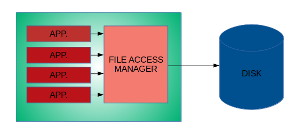
- Problems with Early Information systems:
  - Disorganized development which causes data isolation and data redundancy
  - Redundancy => Inconsistency
  - Concurrency => updation of shared data
  - Security
  - Integrity constraints
-------------------------------------------------------------------------------
- Role of DBMS:

  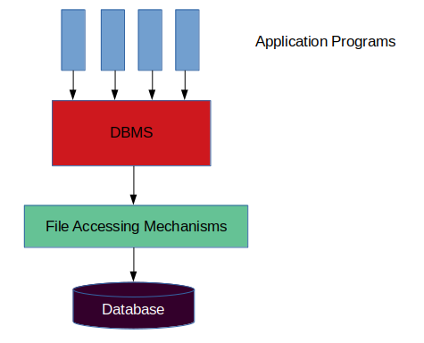
-------------------------------------------------------------------------------
- Levels of Data Abstraction:
  - Physical Level: How the data is stored physically in the disk. (Implementation level)
  - Conceptual Level: What is the data, what are the fields, how the data is related. (Design Level, admin level)
  - View Level: The conceptual level to a sophisticated user/application developer.
  - User Level: The conceptual level to a naive user(who cannot program anything, just to watch the data).
- **Schema:** The definition of the database, what are the fields, what is the type of each field.
- **Instance:** A particular set of data following a schema is called Instance
-------------------------------------------------------------------------------
- Components of a database:
  - User's:
    - Data Definition Language. (DDL)
    - Data Manipulation Language. (DML) (Retrieve, Insert, Delete, Update) => Often called Query Language.
      1) Procedural
      2) Non Procedural
      3) Mixed
- DBMS components:

  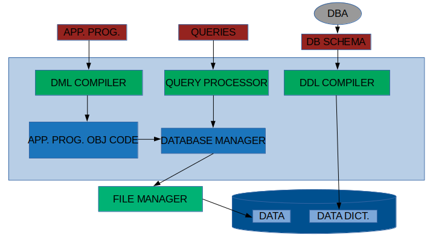
-------------------------------------------------------------------------------
- Role of Database manager: DB manager is very significant part of the DBMS
  - Interface with File manager.
  - Integrity constraint enforcement.
  - Backup and recovery.
  - Concurrecy control.
  - Security.
  - Prevents Data Redundancy and Inconsistency.
-------------------------------------------------------------------------------
- **Data Models:** Tools to conceptually design the database.
  - Entity-Relationship model (Object based model)
  - Relational Model (Record based model)
  - Network Model (Record based model)
  - Hierarchial model (Record based model)
  - Object-Oriented data model (Object based model)
  - Semantic data model (Object based model)
  - Functional data model (Object based model)

- Entity Relationship Model: E-R Model
  - Entities
  - Attributes
  - Relationship
  Example: Library Management

  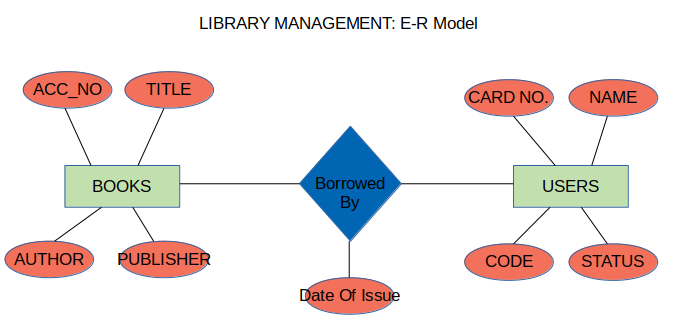
  
- Relational model:
  - Tables/Relations (Columns: Attributes of ER model)
  Example: Library management

  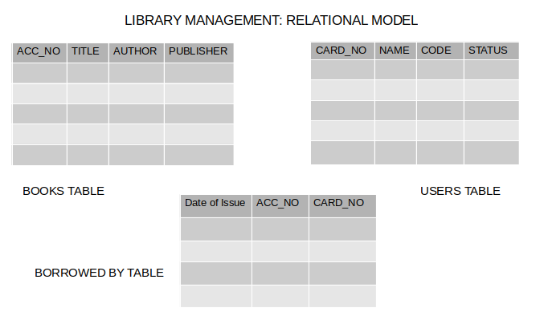
  
- Network Model:
  - Records and Pointers
  Note: Cycles are possible, so it is a graph model

  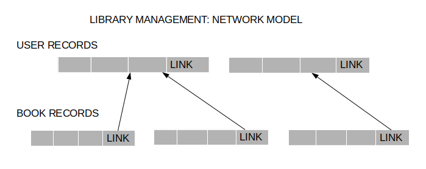
  
- Hierarchial Model:
  - Records and pointers
  Note: Only a tree model, may require duplication
      : Useful when the structure is inherantly tree.

  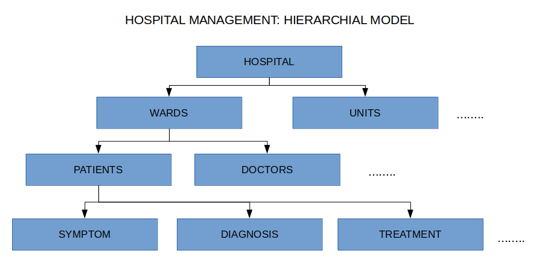

-------------------------------------------------------------------------------

### CONCEPTUAL DESIGN
- Using Entity Relationship Model (ER Modelling).
-------------------------------------------------------------------------------
- ENTITY: A distinguishable object of a DB.
  Examples:
  - Any particular book (Compiler design by Aho,Sethi, Ullmann published in the year 1992, published by Addison wesley with accession number 722756).
  - Any particular user (Ajay singh , project staff, Cryogenics Dept, Card-No C-56).
  - Any particular supplier to the library.
- ENTITY SET: Collection of entities of same type/structure.
  Example:
  - Book
  - User
  - Supplier
-------------------------------------------------------------------------------
- ATTRIBUTE: Specifies part of any entity structure. It is a mapping from an entity set to a domain of values.
  Note: No two entities will have all the attributes same in an entity set. It is defined as a set by definition.
  Examples:
  - Book entity have the attributes:
    - PUBLISHER which has its value mapped to STRING.
    - NAME which has its value mapped to STRING.
    - AUTHOR which has its value mapped to STRING.
    - ACCESSION NUMBER which has its value mapped to INTEGER.
    - PUBLISHED DATE which has its value mapped to INTEGER.
-------------------------------------------------------------------------------
- RELATIONSHIP: An association/mapping between entities.
- RELATIONSHIP SET: Collection of relationships between same/similar entities(so that it becomes a set of relationships between entity sets).

  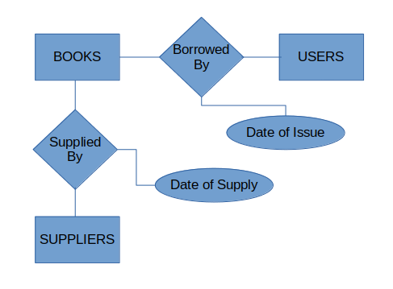

- Note:
  1) The Borrowed By relationship is defined by the attributes from USER and BOOKS entity sets.
  2) The Supplied By relationship is defined by the attributes from USER and SUPPLIERS entity sets.
  3) Other than the attributes from the entities, a relationship may have it's own attributes to define the relationship.
  4) A relationship set may not be binary always, it can be n-ary relationship set.
  5) A relationship set may not be between 2/more different entity sets. It can be between same entity set(one entity set).
     Example:

       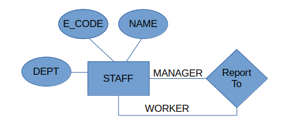

-------------------------------------------------------------------------------
- Mapping Constraints:
  
  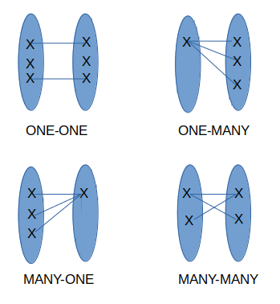
  
  Note: all these are for binary relations.
  - ONE-ONE: One from left entity to only one on right entity.
  - ONE-MANY: One from left entity to many on right entity. But one from left set can't be mapped to many on right set.
  - MANY-ONE: many from left set to one on right set. But one from right set can't be mapped to many on left set.
  - MANY-MANY: Many from left set can be mapped to many on right set. Combination of both MANY-ONE and ONE-MANY.
  
  - There can be some entities in the set that are not at all mapped.
  Note: If there is an arrow on the link between entity set and the relation ship set, then it has either one-many/one-one mapping.
  Note: If there is nothing on the link between entity set and the relationship set, then it has either many-one/many-many mapping.
  TODO: Some clarity needed on the relatioships here. How to place the arrows?
  
  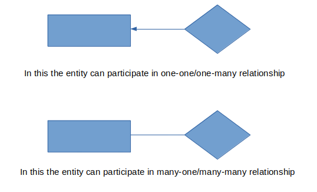
  - Examples:
    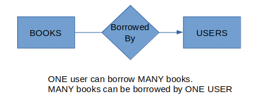
-------------------------------------------------------------------------------
- Existence Dependencies:
  
  
  - In the above relationship, let's say that for every account entity there will be a customer. Then we say that ACCOUNT entity is EXISTENCE DEPENDENT on CUSTOMER entity.
  - In such cases, the entity set which is existent dependent is called WEAK ENTITY.
  - A weak entity is defined by it's own set of attributes along with the primary key of the strong entity (which the weak entity is dependendant on).
-------------------------------------------------------------------------------
- KEY ATTRIBUTE: 
  - SUPER KEY: A set of one or more attributes, which taken collectively allows us to uniquely identify and entity in an entity set.
  - CANDIDATE KEY: A superkey for which no proper subset is a superkey. (a super key may have some attributes, which when removed, the remaining attributes can uniquely identiy an entity in the set. Such superkeys are called candidate keys).
  - PRIMARY KEY: A candidate key chosen by the conceptual designer as the chief attribute set by which an entity is identified in an entity set.
-------------------------------------------------------------------------------
- GENERALIZATION:

  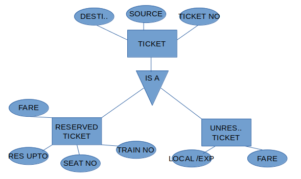
  
  - In the above relation Ticket is the generalization of both RESERVED TICKET and UNRESERVED TICKET.
  - The attributes of RESERVED/UNRESERVED TICKET are the combination of TICKET's attributes along with their own special attributes.
  - The attributes of TICKET are inherited to RESERVED & UNRESERVED TICKET.
-------------------------------------------------------------------------------
- AGGREGATION:
  
  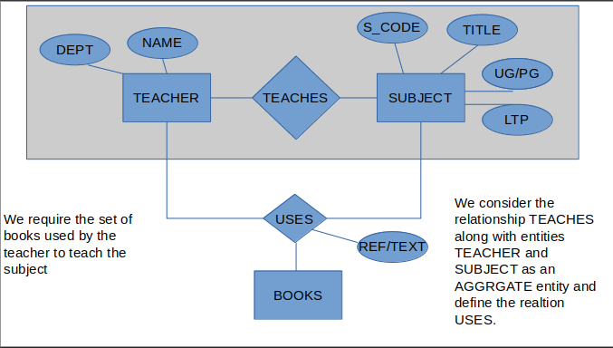
  
  Question: Why can't we design a ternary relation between BOOKS, TEACHER and SUBJECTS?
  Question: what is the difference between a ternary relation and Aggregation?
  
  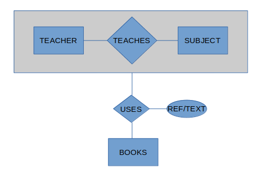
-------------------------------------------------------------------------------
- ER model from Relational Model point of view:
  - Relational model consists of set of tables, and columns correponding to the attributes.
  - For an entity set we create a table, and the columns will be the attributes of that entity set.
  - For the relationship set, we have a table and the attributes of the relationship set. Ideally along with that we have the attributes of the participating entity sets.
  - But from the above definitions of KEY and PRIMARY KEY, we can have only the primary key attributes, thus to identify the entities in the entity set.
  Example2:
  
  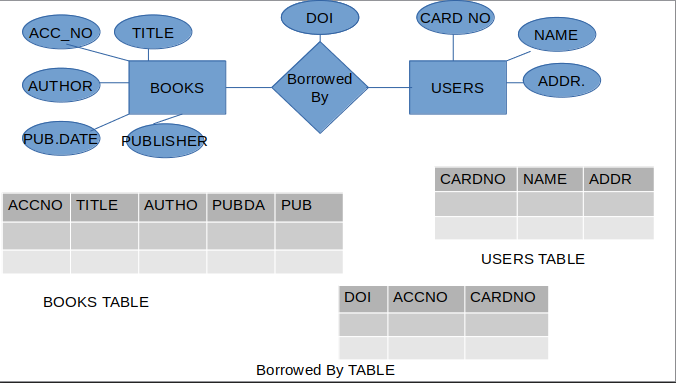
  
  In the above even if we add any mapping constraints, there will be no change in the tables. Because if only mapping constraints are specified there may be entities which are not at all mapped.
  
  Example2: (Weak entity)
  
  
  
  In the above model, we can combine the ACCOUNT entity set and the ACC relation as each entity in the ACCOUNT will be in ACC relationship.
  
  Example3: (Generalization)
  
  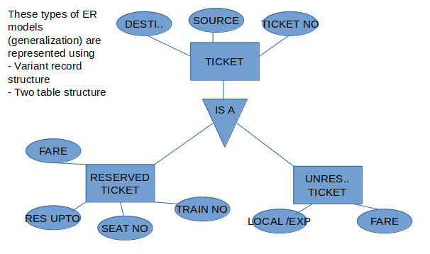
  
  Example4: (Aggregation)
  
-------------------------------------------------------------------------------
- Database Scheme:
  
  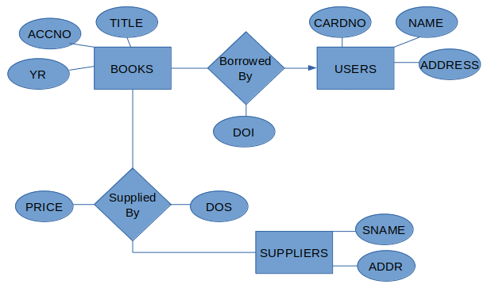
  
  Scheme definition for the above ER model:
  ```
  BOOKS_SCHEME(**ACCNO**, YR, TITLE);
  USERS_SCHEME(**CARDNO**, NAME, ADDR);
  SUPPLIERS_SCHEME(**SNAME**, ADDR);
  BORROWED\_By\_SCHEME(ACCNO,CARDNO, DOI); -- ACCNO and DOI combined will be a primary key.
  SUPPLIED\_By\_SCHEME(ACCNO,PRICE,DOS,SAME);
  ```
  Database declaration:
  ```
  book(BOOKS_SCHEME)
  user(USERS_SCHEME)
  supplier(SUPPLIERS_SCHEME)
  borrowed(BORROWED\_BY\_SCHEME)
  supplied(SUPPIED\_BY\_SCHEME)
  ```
-------------------------------------------------------------------------------

### RELATIONAL ALGEBRA
