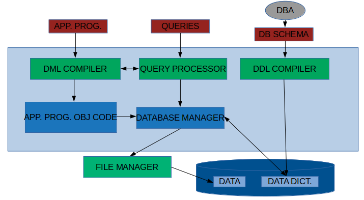

# Database Management Systems

#### Contents
1. [INTRODUCTION](database_management_systems.md#INTRODUCTION)
2. [CONCEPTUAL DESIGN](database_management_systems.md#CONCEPTUAL-DESIGN)
3. [RELATIONAL ALGEBRA](database_management_systems.md#RELATIONAL-ALGEBRA)
4. [RELATIONAL CALCULUS](database_management_systems.md#RELATIONAL-CALCULUS)
5. [SQL](database_management_systems.md#SQL)

-------------------------------------------------------------------------------
### INTRODUCTION
- **Database:** Collection of inter-related data.
- **DBMS:** Database and Query engine (a set of software tools to access, process and modify the data in database).
- Early Information systems: Data is stored in disk and application programs are written to access the disk via file system.
  
- Problems with Early Information systems:
  - Disorganized development which causes data isolation and data redundancy
  - Redundancy => Inconsistency
  - Concurrency => updation of shared data
  - Security
  - Integrity constraints
-------------------------------------------------------------------------------
- Role of DBMS:

  
-------------------------------------------------------------------------------
- Levels of Data Abstraction:
  - Physical Level: How the data is stored physically in the disk. (Implementation level)
  - Conceptual Level: What is the data, what are the fields, how the data is related. (Design Level, admin level)
  - View Level: The conceptual level to a sophisticated user/application developer.
  - User Level: The conceptual level to a naive user(who cannot program anything, just to watch the data).
- **Schema:** The definition of the database, what are the fields, what is the type of each field.
- **Instance:** A particular set of data following a schema is called Instance
-------------------------------------------------------------------------------
- Components of a database:
  - User's:
    - Data Definition Language. (DDL)
    - Data Manipulation Language. (DML) (Retrieve, Insert, Delete, Update) => Often called Query Language.
      1) Procedural
      2) Non Procedural
      3) Mixed
- DBMS components:

  
-------------------------------------------------------------------------------
- Role of Database manager: DB manager is very significant part of the DBMS
  - Interface with File manager.
  - Integrity constraint enforcement.
  - Backup and recovery.
  - Concurrecy control.
  - Security.
  - Prevents Data Redundancy and Inconsistency.
-------------------------------------------------------------------------------
- **Data Models:** Tools to conceptually design the database.
  - Entity-Relationship model (Object based model)
  - Relational Model (Record based model)
  - Network Model (Record based model)
  - Hierarchial model (Record based model)
  - Object-Oriented data model (Object based model)
  - Semantic data model (Object based model)
  - Functional data model (Object based model)

- Entity Relationship Model: E-R Model
  - Entities
  - Attributes
  - Relationship
  Example: Library Management

  
  
- Relational model:
  - Tables/Relations (Columns: Attributes of ER model)
  Example: Library management

  
  
- Network Model:
  - Records and Pointers
  Note: Cycles are possible, so it is a graph model

  
  
- Hierarchial Model:
  - Records and pointers
  Note: Only a tree model, may require duplication
      : Useful when the structure is inherantly tree.

  

-------------------------------------------------------------------------------

### CONCEPTUAL DESIGN
- Using Entity Relationship Model (ER Modelling).
-------------------------------------------------------------------------------
- ENTITY: A distinguishable object of a DB.
  Examples:
  - Any particular book (Compiler design by Aho,Sethi, Ullmann published in the year 1992, published by Addison wesley with accession number 722756).
  - Any particular user (Ajay singh , project staff, Cryogenics Dept, Card-No C-56).
  - Any particular supplier to the library.
- ENTITY SET: Collection of entities of same type/structure.
  Example:
  - Book
  - User
  - Supplier
-------------------------------------------------------------------------------
- ATTRIBUTE: Specifies part of any entity structure. It is a mapping from an entity set to a domain of values.
  Note: No two entities will have all the attributes same in an entity set. It is defined as a set by definition.
  Examples:
  - Book entity have the attributes:
    - PUBLISHER which has its value mapped to STRING.
    - NAME which has its value mapped to STRING.
    - AUTHOR which has its value mapped to STRING.
    - ACCESSION NUMBER which has its value mapped to INTEGER.
    - PUBLISHED DATE which has its value mapped to INTEGER.
-------------------------------------------------------------------------------
- RELATIONSHIP: An association/mapping between entities.
- RELATIONSHIP SET: Collection of relationships between same/similar entities(so that it becomes a set of relationships between entity sets).

  

- Note:
  1) The Borrowed By relationship is defined by the attributes from USER and BOOKS entity sets.
  2) The Supplied By relationship is defined by the attributes from USER and SUPPLIERS entity sets.
  3) Other than the attributes from the entities, a relationship may have it's own attributes to define the relationship.
  4) A relationship set may not be binary always, it can be n-ary relationship set.
  5) A relationship set may not be between 2/more different entity sets. It can be between same entity set(one entity set).
     Example:

       

-------------------------------------------------------------------------------
- Mapping Constraints:
  
  
  
  Note: all these are for binary relations.
  - ONE-ONE: One from left entity to only one on right entity.
  - ONE-MANY: One from left entity to many on right entity. But one from left set can't be mapped to many on right set.
  - MANY-ONE: many from left set to one on right set. But one from right set can't be mapped to many on left set.
  - MANY-MANY: Many from left set can be mapped to many on right set. Combination of both MANY-ONE and ONE-MANY.
  
  - There can be some entities in the set that are not at all mapped.
  Note: If there is an arrow on the link between entity set and the relation ship set, then it has either one-many/one-one mapping.
  Note: If there is nothing on the link between entity set and the relationship set, then it has either many-one/many-many mapping.
  TODO: Some clarity needed on the relatioships here. How to place the arrows?
  
  
  - Examples:
    
-------------------------------------------------------------------------------
- Existence Dependencies:
  
  
  - In the above relationship, let's say that for every account entity there will be a customer. Then we say that ACCOUNT entity is EXISTENCE DEPENDENT on CUSTOMER entity.
  - In such cases, the entity set which is existent dependent is called WEAK ENTITY.
  - A weak entity is defined by it's own set of attributes along with the primary key of the strong entity (which the weak entity is dependendant on).
-------------------------------------------------------------------------------
- KEY ATTRIBUTE: 
  - SUPER KEY: A set of one or more attributes, which taken collectively allows us to uniquely identify and entity in an entity set.
  - CANDIDATE KEY: A superkey for which no proper subset is a superkey. (a super key may have some attributes, which when removed, the remaining attributes can uniquely identiy an entity in the set. Such superkeys are called candidate keys).
  - PRIMARY KEY: A candidate key chosen by the conceptual designer as the chief attribute set by which an entity is identified in an entity set.
-------------------------------------------------------------------------------
- GENERALIZATION:

  
  
  - In the above relation Ticket is the generalization of both RESERVED TICKET and UNRESERVED TICKET.
  - The attributes of RESERVED/UNRESERVED TICKET are the combination of TICKET's attributes along with their own special attributes.
  - The attributes of TICKET are inherited to RESERVED & UNRESERVED TICKET.
-------------------------------------------------------------------------------
- AGGREGATION:
  
  
  
  Question: Why can't we design a ternary relation between BOOKS, TEACHER and SUBJECTS?
  Question: what is the difference between a ternary relation and Aggregation?
  
  
-------------------------------------------------------------------------------
- ER model from Relational Model point of view:
  - Relational model consists of set of tables, and columns correponding to the attributes.
  - For an entity set we create a table, and the columns will be the attributes of that entity set.
  - For the relationship set, we have a table and the attributes of the relationship set. Ideally along with that we have the attributes of the participating entity sets.
  - But from the above definitions of KEY and PRIMARY KEY, we can have only the primary key attributes, thus to identify the entities in the entity set.
  Example2:
  
  
  
  In the above even if we add any mapping constraints, there will be no change in the tables. Because if only mapping constraints are specified there may be entities which are not at all mapped.
  
  Example2: (Weak entity)
  
  
  
  In the above model, we can combine the ACCOUNT entity set and the ACC relation as each entity in the ACCOUNT will be in ACC relationship.
  
  Example3: (Generalization)
  
  
  
  Example4: (Aggregation)
  
-------------------------------------------------------------------------------
- Database Scheme:
  
  
  
  Scheme definition for the above ER model:
  ```
  BOOKS_SCHEME(**ACCNO**, YR, TITLE);
  USERS_SCHEME(**CARDNO**, NAME, ADDR);
  SUPPLIERS_SCHEME(**SNAME**, ADDR);
  BORROWED\_By\_SCHEME(ACCNO,CARDNO, DOI); -- ACCNO and DOI combined will be a primary key.
  SUPPLIED\_By\_SCHEME(ACCNO,PRICE,DOS,SNAME);
  ```
  Database declaration:
  ```
  book(BOOKS_SCHEME)
  user(USERS_SCHEME)
  supplier(SUPPLIERS_SCHEME)
  borrowed(BORROWED\_BY\_SCHEME)
  supplied(SUPPIED\_BY\_SCHEME)
  ```
-------------------------------------------------------------------------------

### RELATIONAL ALGEBRA

- Relational model:
  1. Concept of a relation
     - K = {A, B, C} is a set of attributes.
       dom(A) is the set of values that can be taken by the attribute A. Similarly dom(B), dom(C).
       Let's say:
         dom(A) = {1,2,3}
         dom(B) = Sset of all strings that has length=50
         dom(C) = {'AJAY', 'RAKESH'}
     
         now a realtion in a relational model can be described as :
     
         r ⊆ dom(A) X dom(B) X dom(C)
  2. Unifying idea combining entities & relationships.
  3. May be looked upon as a table of elements where each table is characterized by a set of attributes.
- Each row in a relation is called a **tuple**.
- Database Scheme has:
  - Set of attributes
    ACC_NO, YR_PUB, TITLE, CARD_NO, B_NAME, B_ADDR, S_NAME, S_ADDR, DOI, PRICE, DOS
  - Set of relation schemes
    BOOK_SCHEME(*ACC_NO*, YR_PUB, TITLE)
    USER_SCHEME(*CARD_NO*, B_NAME, B_ADDR)
    SUPPLIER_SCHEME(*S_NAME*, S_ADDR)
    B_BY_SCHEME(*ACC_NO,CARD_NO*, DOI)
    S_BY_SCHEME(*ACC_NO,S_NAME*,PRICE,DOS)
  - Set of relations
    book(BOOK_SCHEME)
    user(USER_SCHEME)
    supplier(SUPPLIER_SCHEME)
    borrow(B_BY_SCHEME)
    supp(S_BY_SCHEME)
- The above definitions are used for the relational algebra and relational calculus examples.
-------------------------------------------------------------------------------
- Relational Algebra: A formal query language based on a set of operation on relations.
  - Fundamental operations:
    1. SELECT:(σ) Select the rows(tuples) of the relation, based on the condition specified. No change in the attributes.
    2. PROJECT: Select the columns(tuples) of the relation, based on the attributes specified. No change in the number of tuples. No duplicated will be allowed.
    3. CARTESIAN PRODUCT:
    4. UNION:
    5. SET DIFFERENCE:
    6. RENAME:
  - Additional Operations (can be defined using the fundamental Operations)
    1. NATURAL JOIN
    2. INTERSECTION
    3. ASSIGNMENT
    4. DIVISION/QUOTIENT
    5. ⊝ - JOIN
  - All the above operations will not modify the database. They will return a new relation.
  TODO: Need to add more info/examples on the above operations, once the character map is set.
- Relational algebra is *procedural* in nature - define the details how to do the query and what are the sequence of steps required to obtain the desired relation.
-------------------------------------------------------------------------------
### RELATIONAL CALCULUS
- Language for defining new relations in a database.
- Forms the basis of a query language.
- Non procedural.
- Uses the concept of formal logic to express relational query.
- Two well known formulations:
  - TUPLE RELATIONAL CALCULUS
  - DOMAIN RELAITONAL CALCULUS
-------------------------------------------------------------------------------
#### TUPLE RELATIONAL CALCULUS
- A relation is expressed as a set.
  `S = {t | P(t)}`
  t - is the tuple variable
  P - is the predicate which must be true for every element of the set i.e., P(t) must be true for every tuple in S.

  - Example:
    S = { t | t ∈  book ∧ t[YR_PUB] = 1992} or S = { t | t ∈  book(t[YR_PUB] = 1992)}

    Here S is the resultant relation, and the attributes of S are the attributes of the relation *book*.
    And S will contain the books that are published in the year 1992.

  - Example:
    S = {t | ∃u∈ book(u[YR_PUB] = 1991) ∧ t[ACC_NO] = u[ACC_NO] ∧ t[TITLE] = u[TITLE]}

    Now the resultant relation S has the attributes ACC_NO and TITLE of all the books that are published in the year 1991.

  - Example
    S = {t | ∃s∈ supp ∧ s[PRICE] > 1000 ∧ s[S_NAME] = t[S_NAME]}

    The attribute in S is only S_NAME of all the suppliers who supplied atleast a book whose price is greater than 1000.
-------------------------------------------------------------------------------

- Problems:
  1. Find all the borrowers (B_NAMES) and their addresses (B_ADDR) for those who have been issued a book on 14/08/95.

     - {t | ∃u∈ user (t[B_NAME] = u[B_NAME] ∧ t[B_ADDR] = u[B_ADDR] ∧ ∃w∈  borrow(w[CARD_NO] = u[CARD_NO] ∧ w[DOI] = '14/08/95'))}
     - {t | ∃w∈ borrow (w[DOI] = '14/08/95' ∧ ∃u∈ user (w[CARD_NO] = u[CARD_NO] ∧ t[B_NAME] = u[B_NAME] ∧ t[B_ADDR] = u[B_ADDR]))}

  2. Find all the borrowers who have been issued a book supplied by "NAROSA" or "ALLIED"

     - {t | ∃u∈ user (t[B_NAME] = u[B_NAME] ∧ ∃b∈ borrow (b[CARD_NO] = u[CARD_NO] ∧ ∃s∈ supp (b[ACC_NO] = s[ACC_NO] ∧ (s[S_NAME] = "NAROSA" ∨ s{[S_NAME] == "ALLIED"))))}
  3. Find all borrowers who have been issued a book supplied by NAROSA but have not been issued any book supplied by ALLIED.

     - {t | ∃u∈ user(t[B_NAME] = u[B_NAME] ∧ ∃b∈ borrow (u[CARD_NO] = b[CARD_NO] ∧ (∃s∈ supp (s[ACC_NO] = b[ACC_NO] ∧ s[S_NAME] = "NAROSA")) ∧ ¬∃q∈ supp (q[ACC_NO] = b[ACC_NO] ∧ q[S_NAME] = "ALLIED")))}
     NOTE: observe the q[ACC_NO] = b[ACC_NO]

  4. Find the names of all suppliers who have the same address as NAROSA.

     - {t | ∃s∈ supp (t[S_NAME] = s[S_NAME] ∧ ∃u∈ supp (u[S_ADDR] = s[S_AADR] ∧ u[S_NAME] = "NAROSA"))}

  5. Find the supplier who has supplied titles correspnding to SOME of  the books that are issued to VIJAY.

     - Need to answer it!!

  6. Find the suppliers who have supplied titles corresponding to ALL BOOKS issued to VIJAY.

     - Need to answer it!! Hint (Use ∀ )

  7. S = {t | ∀u∈ book (t[TITLE] = u[TITLE] ⇒ u[YR_PUB] = 1991)}

     All the tuples t in S will have the all the titles of the books which are published in 1991. 
-------------------------------------------------------------------------------
- Safety of expressions:
  - {t | ¬ (t∈ book} --> Not safe, because the domain is not defined.
    dom(P) = The set of all values referenced by P.
    The expression {t | P(t)} is said to be SAFE if all the values that appear in the RESULT are values from dom(P).
-------------------------------------------------------------------------------
- THEOREM:
  TUPLE RELATIONAL CALCULUS RESTRICTED TO SAFE EXPRESSIONS IS EQUIVALENT TO RELATIONAL ALGEBRA IN EXPRESSIVE POWER.
-------------------------------------------------------------------------------

### SQL

- Commercial Database languages:
  - SQL (based on both Relational Algebra and Relational Calculus)\*\*
  - QUEL (based on Tuple relational calculus)
  - QBE (table driven language based on domain relational calculus)
  - etc.,,
- All the above have the power of DDL, DML, expressing CONSTRAINTS, AUTHORIZATION etc.,
-------------------------------------------------------------------------------
- Strucuted Query Language.
  - Data Definition language - DDL.
  - Interactive Data Manipulation language -DML.
  - Embedded DML.
  - View Definition.
  - Authorization.
  - Integrity constraints.
  - Transacation Definition and Control.
- Query Processing using SQL:
  - Example Library Database:
    ```
    book(*ACC_NO*, YR_PUB, TITLE)
    user(*CARD_NO*, B_NAME, B_ADDR)
    supplier(*S_NAME*, S_ADDR)
    borrow(*ACC_NO,CARD_NO*, DOI)
    supp(*ACC_NO,S_NAME*,PRICE,DOS)
    ```
- Structure of a query:
   ```
   SELECT A1,A1,...An   <----- set of attributes
   FROM r1,r2,...rm     <----- set of relations
   WHERE P              <----- Predicate
   ```
- Examples:
  1. SELECT TITLE FROM BOOK                  <-- behaves as per default setting
  1.1. SELECT ALL TITLE FROM BOOK              <-- includes duplicate titles also
  1.2. SELECT DISTINCT TITLE FROM BOOK         <-- doesn't include dupilcate titles
  
     eqvt relational algebra expression: ???

  2. SELECT ACC_NO,YR_PUB FROM BOOK WHERE TITLE="COMPILER DESIGN"
  
     eqvt relational algebra expression: ???

  3. (SELECT ACC_NO FROM BOOK WHERE TITLE="COMPILER DESIGN") MINUS (SELECT ACC_NO FROM BORROW)
  
     eqvt relational algebra expression: ???

  NOTE: Similar to MINUS we have UNION, INTERSECTION 
  4. SELECT CARD_NO FROM BOOK,BORROW WHERE BOOK.ACC_NO = BORROW.ACC_NO
  
     eqvt relational algebra expression: ??? (CARTESIAN PRODUCT)

-------------------------------------------------------------------------------
- Problems
  1. Find out the CARD_NO of the borrowers who have taken a book titled compiler design.

     eqvt relational algebra:???

     SELECT CARD_NO FROM BOOK,BORROW WHERE (BOOK.ACC_NO = BORROW.ACC_NO) AND (BOOK.TITLE = "COMPILER DESIGN")

     SELECT CARD_NO FROM BORROW WHERE ACC_NO IN (SELECT ACC_NO FROM BOOK WHERE TITLE = "COMPILER DESIGN")

  NOTE: IN is set operation to check if it is in the set of values returned(IS AN ELEMENT).

  2. Find out the NAME and ADDRESS of borrowers who have issued a book on 15/08/94.

     eqvt relational algebra:???

     SELECT B_NAME,B_ADDR FROM USER,BORROW WHERE (USER.CARD_NO = BORROW.CARD_NO) AND (BORROW.DOI = "15/08/94")

     SELECT DISTINCT B_NAME,B_ADDR FROM USER u, BORROW b WHERE (u.CARD_NO = b.CARD_NO) AND (b.DOI = "15/08/94")

  3. Find out the names of all borrowers who have the same address as VIJAY.

     eqvt relational algebra:???

     SELECT T.B_NAME FROM USER T, USER S WHERE (S.B_NAME = "VIJAY") AND (T.B_ADDR = S.B_ADDR)


  Example:
  SELECT T.ACC_NO, T.S_NAME FROM SUPP T, SUPP S WHERE (T.PRICE > S.PRICE) AND (S.S_NAME = "NAROSA")
 
    - What does the above ques mean?

      Find out the supplier name and the accession number of those books which cost more than the least price of the book supplied by NAROSA.
      or
      Find out the supplier name and the accession number of those books which cost more than any one book supplied by NAROSA.
      It may even include even NAROSA.

  4. SELECT ACC_NO,S_NAME FROM SUPP WHERE PRICE > SOME(SELECT PRICE FROM SUPP WHERE SUPP.S_NAME = "NAROSA")

  NOTE: In the above we can replace > with <, >=, <=, !=, = and SOME can be replaced with ALL.

  5. SELECT T.S_NAME FROM SUPP T WHERE (SELECT TITLE FROM BOOK S WHERE T.ACC_NO=S.ACC_NO) CONTAINS (SELECT TITLE FROM BOOK,USER,BORROW WHERE BOOK.ACC_NO=BORROW.ACC_NO AND USER.CARD_NO=BORROW.CARD_NO AND USER.B_NAME="VIJAY")

     Give the names of the suppliers who supplied all the books with the titles same as the books borrowed by VIJAY.

  6. SELECT B_NAME FROM USER T WHERE EXISTS (SELECT * FROM SUPP,BORROW WHERE SUPP.ACC_NO = BORROW.ACC_NO AND T.CARD_NO = BORROW.CARD_NO AND S_NAME = "NAROSA") AND NOT EXISTS (SELECT * FROM SUPP,BORROW WHERE SUPP.ACC_NO = BORROW.ACC_NO AND T.CARD_NO = BORROW.CARD_NO AND S_NAME = "ALLIED")

     Give the borrower names who have borrowed atleast one book supplied by NAROSA and no books supplied by ALLIED.

  7. SELECT S_NAME FROM SUPP WHERE PRICE > 1000 ORDER BY S_NAME

     Give the names of the suppliers who supply the books with PRICE > 1000. And it will give the names in an order(ascending or descending based on default setting).

    SELECT S_NAME FROM SUPP WHERE PRICE > 1000 ORDER_BY S_NAME ASC  ------------> explicitly in ascending order 
    SELECT S_NAME FROM SUPP WHERE PRICE > 1000 ORDER_BY S_NAME DESC ------------> explicitly in descending order 

  8. SELECT * FROM BOOK ORDER BY YR_PUB ASC, ACC_NO DESC

     Will select all the attributes(*) of the BOOK, will order the tuples in ascending order of YR_PUB and if there are multiple entries with same YR_PUB, it will then order them in descending order of ACC_NO.

  9. Aggregate Functions: AVG, MIN, MAX, SUM, COUNT

     SELECT S_NAME,AVG(PRICE) FROM SUPP GROUP BY S_NAME

     Will give the S_NAME and average price of all the books supplied by suppliers with the same S_NAME.

     SELECT S_NAME,SUM(PRICE) FROM SUPP GROUP BY S_NAME

     Will give the S_NAME and total price of all the books supplied by suppliers with the same S_NAME.

     SELECT TITLE,COUNT(ACC_NO) FROM BOOK GROUP BY TITLE

  10. Find out the titles of all the books which have  more that 50 copies

      SELECT TITLE FROM BOOK GROUP BY TITLE HAVING COUNT(ACC_NO) > 50

      Note: HAVING is used on aggregat functions.

  11. List supplier names with total number of books supplied by each supplier and the total value of books supplied by them.

      SELECT S_NAME,COUNT(ACC_NO),SUM(PRICE) FROM SUPP GROUP BY S_NAME  

  12. List out the names of all borrowers and the number of distinct titles of books issued to them.

      SELECT B_NAME, COUNT(DISTINCT TITLES) FROM USER,BORROW,BOOK WHERE USER.CARD_NO == BORROW.CARD_NO AND BORROW.ACC_NO == BOOK.ACC_NO GROUP BY B_NAME ORDER BY B_NAME

  13. List out the names of all borrowers and the number of books borrowed by each user.

      SELECT B_NAME, COUNT(ACC_NO) FROM USER,BORROW WHERE USER.CARD_NO == BORROW.CARD_NO GROUP BY B_NAME ORDER BY B_NAME

  14. SELECT S_NAME FROM SUPP GROUP BY S_NAME HAVING MAX(PRICE) >= ALL (SELECT MAX(PRICE) FROM SUPP GROUP BY S_NAME)

      List of supplier names who has supplied the book with largest/highest price.

  Modify operations: INSERT, DELETE, UPDATE
  Data Defintions: 
