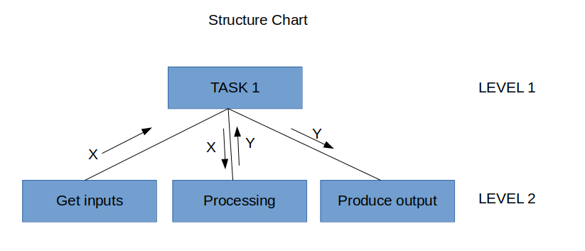
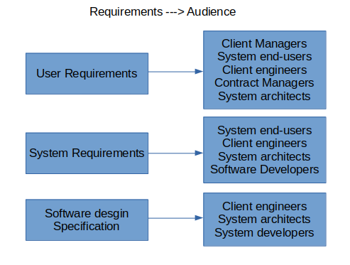

# Software Engineering

#### Contents
1. [INTRODUCTION](software_engineering.md#INTRODUCTION)
2. [PHASES OF SDLC](software_engineering.md#PHASES-OF-SDLC)
3. [REQUIREMENTS ENGINEERING](software_engineering.md#REQUIREMENTS_ENGINEERING)


### INTRODUCTION
- Challenges in Large Software Projects:
  - Effort intensive
  - High cost
  - Long Development time
  - Changing requirements from users
  - High risk of failure: user acceptance, performance, maintainability etc.,
- Successful software is one which is cost effective, easily maintainable and it is useful,usable and being used.
- Reasons of failure of a software system is due to many reasons like 1) development not completed in time 2) Cost over-runs 3) Not useful 4) Poor Quality 5) maintainability.
- All the above reasons are as a result of Ad-hoc software development (No planning, poor understanding of user requirements, no reviews etc.,).
- In other domains of engineering(Building DAMS, Bridges, Power plants), there are large projects that are completed successfully.
- So as a result **Engineering** is used as a solution to software development, to reduce the failures in delivering a s/w system.
  *To design, develop (build and fabricate) and artifact that meets specifications efficiently, cost effectively ensuring quality.* or *To use scientific principles.*
- Engineering approach(process) applied to software development:
  1) Attempt to estimate cost/effort.
  2) Plan and schedule work.
  3) Involve user in defining requirements.
  4) Identify stages in development.
  5) Define clear milestones so that progress can be measured.
  6) Schedule reviews both for control and quality.
  7) Define deliverables.
  8) Plan extensive testing.
- **Software Process:** A process consist of activities/steps to be carried out in a particular order. A software process deals with technical and management issues for a software project.
  - Software Development (Software Development Life Cycle: SDLC)
  - Project Management
  - Change Management
  - Process to manage all the above processes (ISO/CMM)
- A large company can use multiple software processes to deal with different types of software projects.
- A process consists of different steps. Each step has a well defined objective, specific inputs and defined outputs and also require special skilled people to carry out. Each step has an entry point and an exit point.
- These steps are carried out as per the project plan -> which gives the duration of the project, effort estimation of the project, resources required etc.,
- Each step ends in a review which verifies and validates the step(whether it is successfully completed or not).
  == Image: how a step in each process will work ==
- Characteristics of a Good Process:
  - Should be precisely defined - no ambiguity about what is to be done, when, how etc.,
  - Must be predictable with respect to effort, cost, quality.
  - Supports testing and maintainability.
  - Facilitates early detection and removal of defects.
  - Facilitate monitoring and improvement.
- Example SDLC: Waterfall Model, Prototyping model, Iterative model, Spiral Model.
- **Waterfall Model:**
  == Image: representation of waterfall model == 
  - Steps:
    - System Engineering
    - Analysis & Project planning
    - Design
    - Code
    - Testing & Integration
    - Installation & Maintenance
  - Deliverables:
    - Project Planning and feasibility report
    - Requirement Specification (Software Requirement Specification: SRS)
    - System Design Document
    - Test plans and Test reports
    - Source code in executable form
    - Software manuals like user manuals or installation manuals
    - Review reports
  - The cumulative cost/effort distribution increases as we move to the end steps
  - Shortcomings:
    - Requirements may not be clearly known especially for applications not having existing manual counterpart.
      Ex: Railway reservation system: manual system existed, which implies SRS can be specified exactly.
      Ex: Knowledge management for a central bank: no manual system, SRS may not be clear.
    - Requirements change with time during project life cycle itself.
    - Documentation heavy - may not require for all types of projects.
- **Prototyping Model:** when the customer/developer is not sure about requirements/algorithms/efficiency/human-machine interaction.
  == Image: representation of prototyping model ==
  - Steps:
  - Limitations:
    - Customer may want the prototype itself.
    - Developer may continue with the implementation choices made during prototyping.
    - Good tools required to quick development.
    - May increase project cost.
- **Iterative Development:** Where product is defined by many features. Early version with limited features to establish market and get customer feedback. Developed in versions. Each version may follow any model to develop s/w.
   == Image: representation of iterative model ==
- **Spiral Model:** Activities are arranged in a spiral having many cycles, and each cycle has four quadrants.
  == Image: representation of spiral model ==
  - Quadrants:
    - Determine objectives, alternatives and constraints.
    - Evaluate alternatives, identify and handle risks.
    - Develop the s/w.
    - Plan the next step.
- **Project Management process:**
  - Runs in parallel to development process.
  - Project planning
    - Steps:
      - Estimate Cost/Effort.
      - Select development process, define milestones and prepare schedule.
      - Decide on project staffing.
      - Make quality control plans: reviews, inspection and testing strategies
  - Project monitoring and controlling.
    - Critical paths, gnatt charts etc..,

### PHASES OF SDLC
- Main steps in an SDLC:
  1.Problem Definition:
    - What is the problem? Where and by whom the problem is faced?
    - Meet users and management and get their agreement on the problem and decide on going on for a project.
    - Brief statement of the problem in a document format (**Problem Definition Document**).
    - Estimate the cost and schedule of the feasibility study. And also roughly estimated cost for the whole project.
    - Short process.
  2.Feasibility Study:
    - Understanding the problems and reasons with existing system.
    - Answer the questions?
      - Is there a feasible solution?
      - Is the problem worth solution?
    - Understanding the alternative solution and their estimated cost.
    - Do quick design and analysis.
    - Report the alternative solutions and costs in the form of a document(**Feasibility Study Report**).
    - Many projects get terminated here.
    - Types of Feasibility:
      - Economical: Will the returns on the project justify the investment?
      - Technical: Is technology available?
      - Operational: Will it be operationally feasible to deploy in the organization?
    - Study about Costs(Initial and recurring) and Benefits(tangible and intangible)!
  3.Planning(Optional)
  4.(Requirement) Analysis:
    - Determine what to do to solve the problem (without how!).
    - Covers what and how the problem is solved at business level.
    - All the functional/performance requirements and important constraints are defined.
    - Done by an Analyst and output is **Software Requirement Specification**.
    - Incorrect, ambiguous, incomplete, inconsistent SRS can lead to project failures.
    - Basis/Reference document for subsequent design phases.
    - A fault at this level may cause 2 to 25 times more cost in the following steps.
    - Long process.
    - Data models are used to represent/organize the user inputs/requirements.
  5.System Design:
    - How to solve the problem?
    - Consider several technical alternatives based on automation, boundaries etc.,
    - For each alternative, prepare high level system-design, implementation schedule and cost-benefit analysis.
    - Then prepare for the review with technical and management teams.
    - Should end with a final clear choice.
    - System Architecture:
      - Decompose a complex system: 1) Partitions(vertical) 2) Layers (Horizontal)
      - Modules are the building blocks. Higher level modules do co-ordination/control where as lower modules do computation tasks.
      - Some modules can be iterated and some modules may be visited on a conditional basis, we can represent this in the *structure chart* with a specific notation without providing much details.
    - OO Approach:
      - Decompose into packages. Building blocks are classes.
    - Output is the **Design Document**.
  6.Detailed Design:
    - Specific implementation explaining overall system architecture, modules etc.,
    - Each component is further refined to proceed with implementation.
    - Program spec(psuedo-code), file design(organization, access method), h/w specifications, test plans, implementation schedule are the deliverables here.
    - A technical review happens here.
  7.Implementation
    - Programs are coded, debugged and documented here.
    - Create operating procedures for users.
  8.Maintenance

- SRS Format: (Based on IEEE recommendation)
  ```
  1. Introduction
     1.1. Purpose: Clearly state the purpose of the document.
     1.2. Scope: By whom and how it will be used.
     1.3. Definitions: Acronyms, Abbreviations as applicable.
     1.4. References: to other documents.
     1.5. Overview of Developer's Responsibilities: In terms of development, installation, training, maintenance etc.,
  2. General Description
     2.1. Product perspective: relationship with other products and principle interfaces.
     2.2. Product functions overview: general overview of tasks, including data flow diagrams.
     2.3. User Characteristics: who they are and what training they may need.
     2.4. General Constraints: about schedule, resources, cost etc.,
  3. Functional Requirements
     3.1. Functional Requirement 1
          3.1.1. Introduction
          3.1.2. Inputs
          3.1.3. Processing
          3.1.4. Outputs
     3.2. repeat for each functional requirement
  4. External Interface Requirements
     4.1. User Interfaces: user manual giving commands, screen formats, outputs, error messages etc.,
     4.2. Hardware Interfaces: with existing as well as new or special purpose hardware.
     4.3. Software Interfaces: with other software packages.
  5. Performance Requirements: Capacity requirements, response time, throughput etc.,
  6. Design Constraints
     6.1. Standards Compliance
     6.2. Hardware Limitations
  7. Other Requirements: Like future extensions.
  ```
- Structure Chart: Tool to define system architecture in terms of modules.
  - Used in functional methodology to define modules and their calling relations.
  - Basically a hierarchical structure representing the calling relationship, no control flow information.
  - Module at level i can call a module at level i+1. No other calls are not possible.
  - Notation:

  
- Class Diagrams: Tool to define the system architecture in terms of classes.(We also use Interaction diagrams to explain the dynamic behavior of classes)
- Design Document Format:
  ```
  1. Introduction
  2. Problem Specification
  3. Software Structure
  4. Data definitions
  5. Module specifications
  6. Requirements Tracing
  ```
  
### REQUIREMENTS ENGINEERING
- The process of establishing/translating the services that the customer requires from the system and the involved constraints.
- Requirement: the definitation may range from a high level abstraction statement of a service or of a system constraint to a detailed mathematical functional specification.
- Types of Requirements:
  - User Requirements(Definition): Written for the end users. Statements in natural language/diagrams explaining the services provided by the system and its operational constraints.
    Example: The software must provide a means to access external files created by other tools.
  - System Requirements(Specification): A structured document with detail description of systems functionality, services and operational constraints.
    Example:
    The user should have a facility to define the type of the external file
    Each external file type should have a tool which can be applied to view the file. etc.,
  - Functional Requirements: Statements describing the response/reaction of the system for particular inputs and for particular scenarios.
  - Non-Functional Requirements: Constraints on the services/functions offered by the system. Other than functional requirements.
    - Product Requirements: Execution seed, reliability etc.,
    - Organizational Requirements: process stanadards, implementation requirements etc.,
    - External Requirements: interoperability requirements, legislative requirements etc.,
    - Goals and Requirements: A goal is a general intention of the user where as a requirement is some thing that can be verified/objectively tested.
- Requirements Amalgamation: Combining related requirements to one.
- Requirement Documents and the respective audience

  

- Requirements must be:
  - Complete: should include description of everything that is needed.
  - Consistent: no conflicts or contradictions between the requirements.
- Note: Requirements imprecision/ambiguity would lead to very erroneous system/software which may cause very much loss.
- Alternates to Natural language Specification: 
  - Structured Natural Language(forms/templates)
  - Design Description Languages with graphical notations(UML, sequence charts)
  - Mathematical Specification(ADTs)
